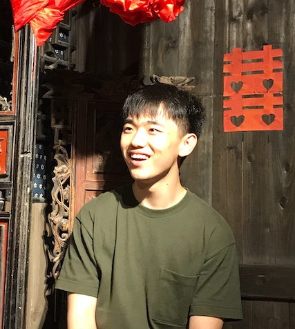
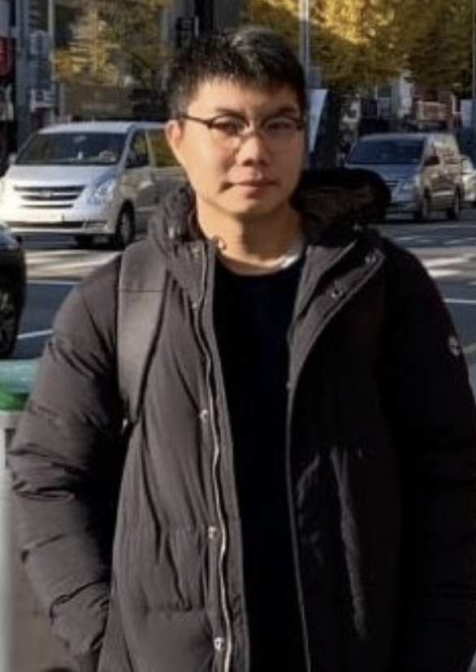
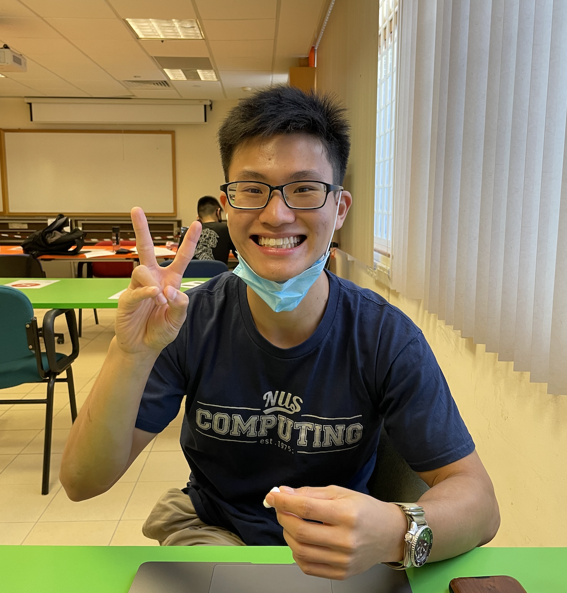
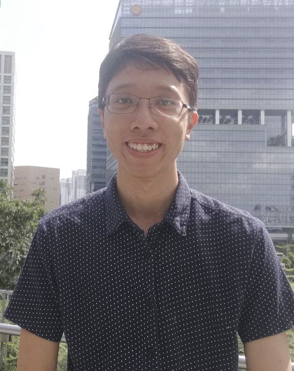

## Meet our team!

**SociaLite** is a project is built for CS2103T Software Engineering.

We are a team based in the School of Computing, National University of Singapore.

### Yan Xiaozhi (David) 

* Role: Team lead
* [Email](mailto:yan_xiaozhi@u.nus.edu)

### Stanley Tan Wen Sheng 

* Role: Code quality & documentation
* [Email](mailto:stanley.tan@u.nus.edu)

### Zachary Chua Yan Ern 

* Role: Integration & code quality
* [Email](mailto:e0543984@u.nus.edu)

### Tan Siong Min, Benjamin 

* Role: Testing & Integration
* [Email](mailto:benjamint@u.nus.edu)

### Tang Swen Yi 

* Role: Testing & documentation
* [Email](mailto:e0532612@u.nus.edu)
