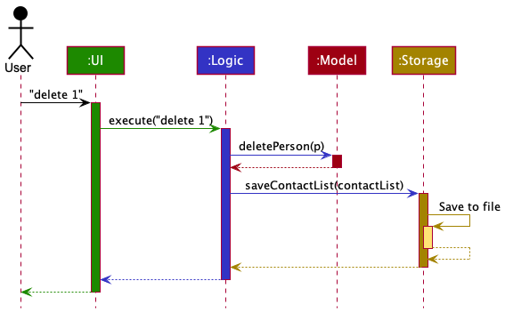
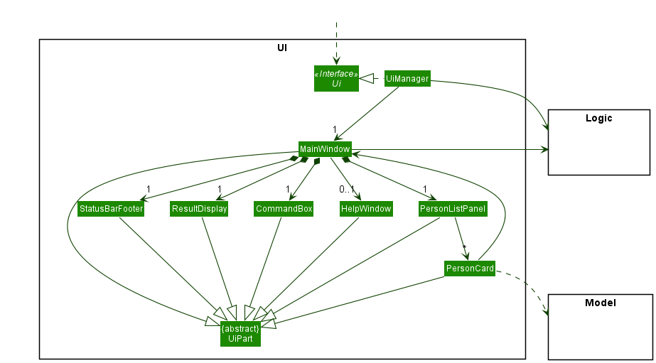
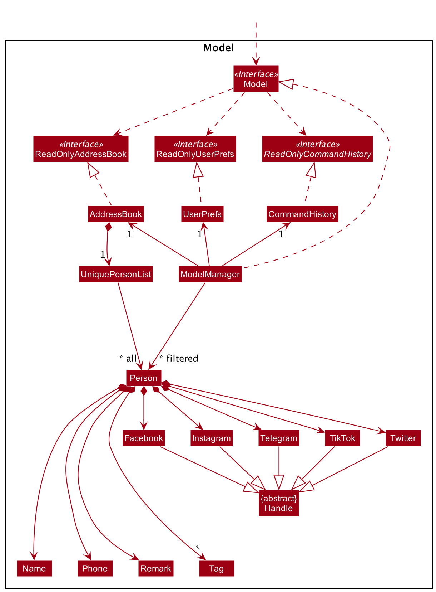
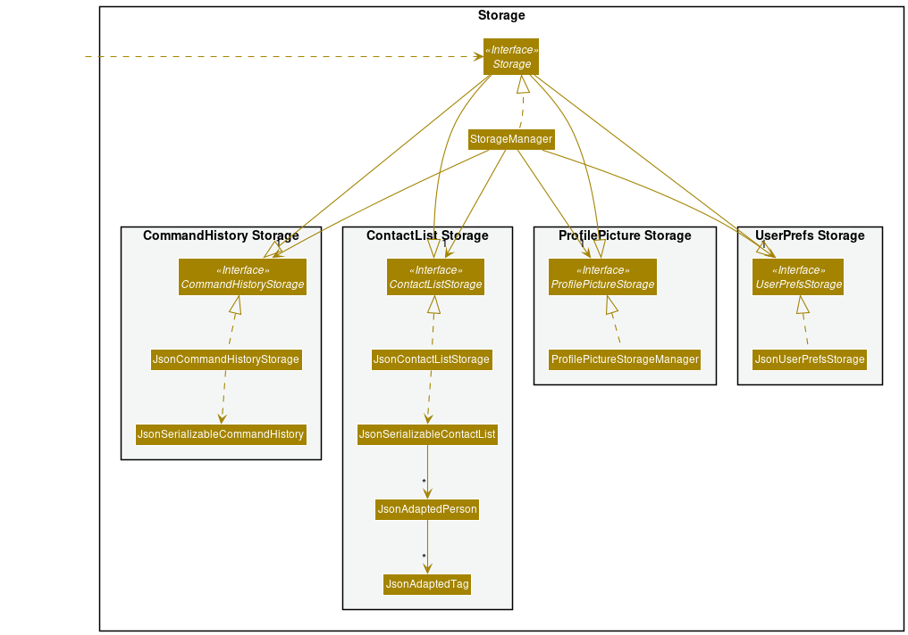
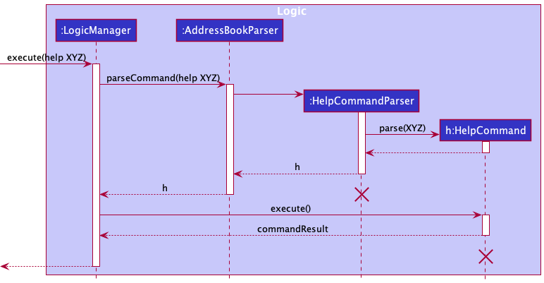
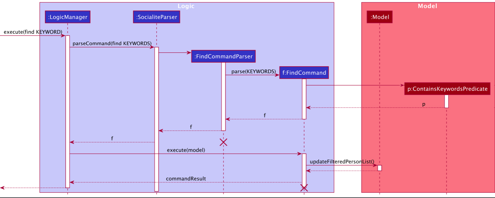
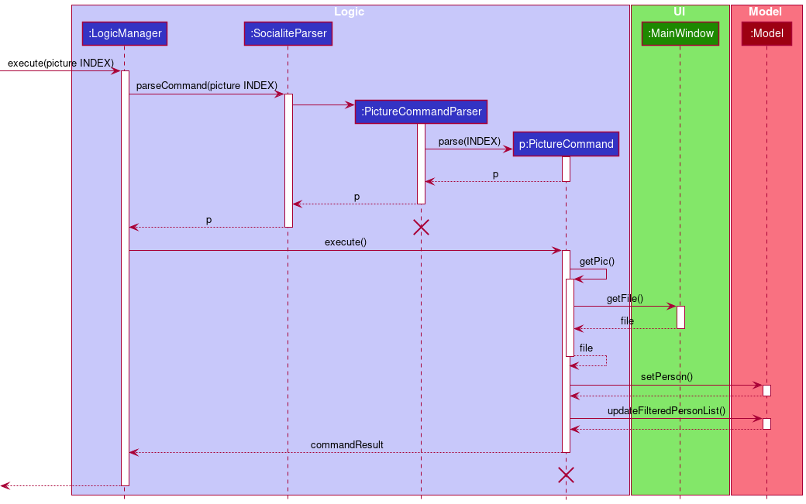
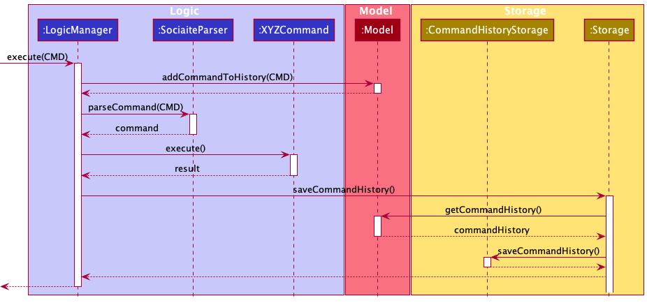

### Table of Contents

1. [Acknowledgements](#acknowledgements)
2. [Setting Up, Getting Started](#setting-up-getting-started)
3. [Design](#design)
    1. [Architecture](#architecture)
    2. [UI Component](#ui)
    3. [Logic Component](#logic)
    4. [Model Component](#model)
    5. [Storage Component](#storage)
    6. [Common Classes](#common)
4. [Implementation](#implementation)
    1. [Help Command](#help_command)
    2. [Find Command](#find_command)
    3. [Picture Command](#picture_command)
    4. [Command History](#command_history)
5. [Documentation](#docs)
6. [Appendix: Requirements](#requirements)
    1. [Product Scope](#scope)
    2. [User Stories](#user-stories)
    3. [Use Cases](#use-cases)
    4. [Non-Functional Requirements](#nfr)
    5. [Glossary](#glossary)

--------------------------------------------------------------------------------------------------------------------

## **Acknowledgements** 

* SociaLite is adapted from SE-Education's [*AddressBook Level-3*](https://se-education.org/addressbook-level3/DeveloperGuide.html).
* GUI tests are adapted from [`src/test/java/guitests/`](https://github.com/se-edu/addressbook-level4/tree/master/src/test/java/guitests) of SE-Education's [*AddressBook Level-4*](https://se-education.org/addressbook-level4/).

--------------------------------------------------------------------------------------------------------------------

## **Setting Up, Getting Started** 

Refer to the guide [_Setting Up and Getting Started_](SettingUp.md).

--------------------------------------------------------------------------------------------------------------------

## **Design** 

:bulb: **Tip:** The `.puml` files used to create diagrams in this document can be found in the [diagrams](https://github.com/AY2122S1-CS2103T-F11-4/tp/tree/master/docs/diagrams) folder. Refer to the [_PlantUML Tutorial_ at se-edu/guides](https://se-education.org/guides/tutorials/plantUml.html) to learn how to create and edit diagrams.

### Architecture 

The ***Architecture Diagram*** given above explains the high-level design of the App.

Given below is a quick overview of main components and how they interact with each other.

**Main components of the architecture**

**`Main`** has two classes called [`Main`](https://github.com/AY2122S1-CS2103T-F11-4/tp/blob/master/src/main/java/socialite/Main.java) and [`MainApp`](https://github.com/AY2122S1-CS2103T-F11-4/tp/blob/master/src/main/java/socialite/MainApp.java). It is responsible for,

* At app launch: Initializes the components in the correct sequence, and connects them with each other.
* At shut down: Shuts down the components and invokes cleanup methods where necessary.

[**`Commons`**](#common) represents a collection of classes used by multiple other components.

The rest of the App consists of four components.

* [**`UI`**](#ui): The UI of the App.
* [**`Logic`**](#logic): Parses and executes the appropriate command according to the user's input.
* [**`Model`**](#model): Holds the data of the App in memory.
* [**`Storage`**](#storage): Reads data from, and writes data to, the hard disk.

**How the architecture components interact with each other**

The *Sequence Diagram* below shows how the components interact with each other for the scenario where the user issues the command `delete 1`.

Each of the four main components (also shown in the diagram above),

* defines its *API* in an `interface` with the same name as the Component.
* implements its functionality using a concrete `{Component Name}Manager` class (which follows the corresponding API `interface` mentioned in the previous point.

For example, the `Logic` component defines its API in the `Logic.java` interface and implements its functionality using the `LogicManager.java` class which follows the `Logic` interface. Other components interact with a given component through its interface rather than the concrete class (reason: to prevent outside component's being coupled to the implementation of a component), as illustrated in the (partial) class diagram below.

The sections below give more details of each component.

### UI component 

The `UI` component interacts with other components of SociaLite, and uses the JavaFX UI framework to render a GUI.

The **API** of this component is specified in [`Ui.java`](https://github.com/AY2122S1-CS2103T-F11-4/tp/blob/master/src/main/java/socialite/ui/Ui.java).

The UI consists of a `MainWindow` that is made up of parts, including `CommandBox`, `ResultDisplay`, `PersonListPanel`, `StatusBarFooter`, etc. All the parts, as well as the `MainWindow`, inherit from the abstract `UiPart` class which captures the commonalities between classes that represent parts of the visible GUI.  The layout of these UI parts are defined in matching `.fxml` files that are in the `src/main/resources/view` folder. For example, the layout of the [`MainWindow`](https://github.com/AY2122S1-CS2103T-F11-4/tp/blob/master/src/main/java/socialite/ui/MainWindow.java) is specified in [`MainWindow.fxml`](https://github.com/AY2122S1-CS2103T-F11-4/tp/blob/master/src/main/resources/view/MainWindow.fxml).

The `UI` component,

* executes user commands using the `Logic` component.
* listens for changes to `Model` data so that the UI can be updated with the modified data.
* keeps a reference to the `Logic` component, because the `UI` relies on the `Logic` to execute commands.
* depends on some classes in the `Model` component, as it displays `Person` object residing in the `Model`.

The `PersonCard` part also has a reference to the `MainWindow` to provide improved user feedback via the main window after user interactions which do not execute a command using `Logic`.

### Logic component 

**API** : [`Logic.java`](https://github.com/AY2122S1-CS2103T-F11-4/tp/blob/master/src/main/java/socialite/logic/Logic.java)

Here's a (partial) class diagram of the `Logic` component:

How the `Logic` component works:
1. When `Logic` is called upon to execute a command, it uses the `SocialiteParser` class to parse the user command.
1. This results in a `Command` object (more precisely, an object of one of its subclasses e.g., `AddCommand`) which is executed by the `LogicManager`.
1. The command can communicate with the `Model` when it is executed (e.g. to add a person).
1. The result of the command execution is encapsulated as a `CommandResult` object which is returned from `Logic`.

The Sequence Diagram below illustrates the interactions within the `Logic` component for the `execute("delete 1")` API call.

:information_source: **Note:** The lifeline for `DeleteCommandParser` should end at the destroy marker (X) but due to a limitation of PlantUML, the lifeline reaches the end of diagram.

Here are the other classes in `Logic` (omitted from the class diagram above) that are used for parsing a user command:

How the parsing works:
* When called upon to parse a user command, the `SocialiteParser` class creates an `XYZCommandParser` (`XYZ` is a placeholder for the specific command name e.g., `AddCommandParser`) which uses the other classes shown above to parse the user command and create a `XYZCommand` object (e.g., `AddCommand`) which the `SocialiteParser` returns back as a `Command` object.
* All `XYZCommandParser` classes (e.g., `AddCommandParser`, `DeleteCommandParser`, ...) inherit from the `Parser` interface so that they can be treated similarly where possible e.g, during testing.

### Model component 
**API** : [`Model.java`](https://github.com/AY2122S1-CS2103T-F11-4/tp/blob/master/src/main/java/socialite/model/Model.java)

The `Model` component,

* stores the contact list data i.e., all `Person` objects (which are contained in a `UniquePersonList` object).
* stores the currently 'selected' `Person` objects (e.g., results of a search query) as a separate _filtered_ list which is exposed to outsiders as an unmodifiable `ObservableList<Person>` that can be 'observed' e.g. the UI can be bound to this list so that the UI automatically updates when the data in the list change.
* stores a `UserPref` object that represents the user’s preferences. This is exposed to the outside as a `ReadOnlyUserPref` objects.
* does not depend on any of the other three components (as the `Model` represents data entities of the domain, they should make sense on their own without depending on other components)

### Storage component 

**API** : [`Storage.java`](https://github.com/AY2122S1-CS2103T-F11-4/tp/blob/master/src/main/java/socialite/storage/Storage.java)

The `Storage` component,
* can save contact list data, user preference data and command history data in json format, and read them back into corresponding objects.
* inherits from `ContactListStorage`, `UserPrefsStorage`, `CommandHistoryStorage` and `ProfilePictureStorage` which means it can be treated as any one (if the functionality of only one is needed).
* depends on some classes in the `Model` component (because the `Storage` component's job is to save/retrieve objects that belong to the `Model`)

### Common classes 

Classes used by multiple components are in the `socialite.commons` package. These include:

* [`core`](https://github.com/AY2122S1-CS2103T-F11-4/tp/tree/master/src/main/java/socialite/commons/core): General classes which deal with storage of SociaLite configuration and GUI settings, logging and commonly used messages. The [`Index`](https://github.com/AY2122S1-CS2103T-F11-4/tp/blob/master/src/main/java/socialite/commons/core/index/Index.java) class is also used widely to manage references to specific items in the contact list.
* [`exceptions`](https://github.com/AY2122S1-CS2103T-F11-4/tp/tree/master/src/main/java/socialite/commons/exceptions): Common exceptions used throughout SociaLite.
* [`util`](https://github.com/AY2122S1-CS2103T-F11-4/tp/tree/master/src/main/java/socialite/commons/util): Utility methods pertaining to collections, files, JSON, strings, etc.

--------------------------------------------------------------------------------------------------------------------

## **Implementation** 

This section describes some noteworthy details on how certain features are implemented.

### Help Command 

In order to simplify the error messages displayed via the GUI whenever a user enters an invalid command or non-conforming command format, 
the display of in-app guidance and help messages has been abstracted away from the specific command. As a result, the existing `HelpCommand` was 
revamped and expanded to display in-app guidance, consisting of the following details for a specified command:
* Overview of specified command's function
* Acceptable format of user input
* Example of using the specified command

Represented below is the sequence diagram when `help XYZ` is executed. For illustration purposes, `XYZ` refers to an acceptable command in SociaLite that has in-app guidance for users' reference.

For the correct `HelpCommand` to be created and appropriate in-app guidance to be displayed, a `HelpCommandParser` was created to parse additional keywords provided by the user. 
The acceptable keywords are: `add` `delete` `edit` `find` `picture` `pin` `unpin` `remark` and `share`.

Should an invalid keyword accompany `help`, the `HelpCommandParser` will create a generic `HelpCommand` that displays the HelpWindow dialog box. 
The HelpWindow dialog box provides users with the link to our User Guide and the list of acceptable keywords (as listed above) to view in-app guidance.

### Find Command 
The Find command allows users to find a contact in their list by keywords.
A contact's name, tags and/or social media platforms can be specified as keywords. 

Command takes inputs of the form `find KEYWORDS`, where `KEYWORDS` can include multiple spaced user inputs,
prefixed with `t/` for tags, `p/` for social media platforms or no prefix for names.

Find Command will update the person list under Model package, based on which contacts match the keywords,
and return a CommandResult which tells how many contacts matched in the search.

Should `KEYWORDS` be improperly formatted or empty, a generic CommandResult with an error message will be given and Model will not be updated.

Below is the sequence diagram for an execution of `find KEYWORDS`, assuming `KEYWORDS` are a valid query string

### Picture Command 

The Picture command allows users to add a profile picture to their contacts. The user can enter the command `picture INDEX` which would open a file browser to let the user choose any .jpg or .png file to be used as the profile picture, provided `INDEX` is a valid index

Represented below is the sequence diagram when `picture INDEX` is executed. For illustration purposes, `INDEX` refers to any valid index starting from 1 to the number of contacts in the displayed list.

Note that the picture command depends on the MainWindow in the UI package as it retrieves the file from a file chooser.

### Command History 

Command history allows users to navigate through commands that they have entered previously by pressing `UP/DOWN` key in the command box. It resembles the behavior of a macOS or Windows terminal. As a result, users can simply make slight edit to the previous command to rectify a typo.

Command history from all previous sessions will be stored in `commandhistory.json`, and loaded as a list of strings in `CommandHistory` class when SociaLite is launched. The command history of the current session will be added to the list of strings, and written back to the `.json` file upon exiting SocaiLite.

If the `.json` file is non-existent or faulty, or if SociaLite encounters any problem reading the `.json` file , it will start with an empty command history.

Represented below is the sequence diagram on how command history is saved when any command is executed. For illustration purposes, `CMD` refers to any command (valid or invalid) that the user type in the command box, `XYZ` is a placeholder for the specific command name.

--------------------------------------------------------------------------------------------------------------------

## **Documentation, logging, testing, configuration, dev-ops** 

* [Documentation guide](Documentation.md)
* [Testing guide](Testing.md)
* [Logging guide](Logging.md)
* [Configuration guide](Configuration.md)
* [DevOps guide](DevOps.md)

--------------------------------------------------------------------------------------------------------------------

## **Appendix: Requirements** 

### Product scope 

**Target user profile**:

* avid social media user
* prefers desktop apps over other types
* prefers typing to mouse interactions
* needs to manage a significant number of contacts
* wants to catch up with their contacts’ activities quickly 
* wants to connect with their followers/friends on various social media platforms through an all-in-one dashboard

**Value proposition**: 

Our product serves as an integrated dashboard for a user to retrieve the social media handles and account information of his/her contacts. This makes it seamless for the user to interact with his/her contacts instead of having to access each social media account that the contact owns.

### User stories 

Priorities: High (must have) - `* * *`, Medium (nice to have) - `* *`, Low (unlikely to have) - `*`

 

_Core Functionalities_

|Priority| As a / an …​                              | I want to …​                                                                    | So that I can…​                                                                                      |
|--------| -------------------------------------------- | ---------------------------------------------------------------------------------- | ------------------------------------------------------------------------------------------------------- |
|`* * *` | beginner user                                | add contacts                                                                       | access my contacts' details                                                                             |
|`* * *` | beginner user                                | delete contacts                                                                    | remove irrelevant entries                                                                               |
|`* * *` | beginner user                                | access the social media handles of my contacts                                     | have quicker access to my contacts' social media pages                                                  |
|`* * *` | forgetful user                               | save my contacts' social media handles                                             | easily access my contact's social media account without having to recall the exact handle               |
|`* * *` | user                                         | visit the social media site when I click on the handle                             | easily go to the social media site, without having to switch to the browser while remembering the handle|
|`* *`   | user                                         | browse a list of all my contacts                                                   | view all my contacts at a glance                                                                        |
|`*`     | beginner user                                | update contacts                                                                    | modify existing social media handles and add new ones when they are created                             |

 

_Guide for New Users_

|Priority| As a / an …​                              | I want to …​                                                                    | So that I can…​                                                                                      |
|--------| -------------------------------------------- | ---------------------------------------------------------------------------------- | ------------------------------------------------------------------------------------------------------- |
|`* *`   | new user                                     | view the User Guide                                                                | learn how to use SociaLite comprehensively                                                              |
|`* *`   | new user                                     | view sample contacts when I initialise the app                                     | try out the features without having to add actual data                                                  |
|`* *`   | new / returning user                         | access in-app guidance for a specific command                                      | (re)learn the syntax of a selected command without having to open the User Guide via a browser          |
|`* *`   | new user adopting the app for my own use     | purge all data                                                                     | delete sample contacts and add real data                                                                |

 

_Organization of Contacts_

| Priority | As a / an …​       | I want to …​                                        | So that I can…​                                               |
| -------- | ----------------- | -------------------------------------------------- | ------------------------------------------------------------ |
| `* *`    | organized user    | create tags to group my contacts                   | organize my list of contacts                                 |
| `* *`    | organized user    | edit tags as and when required                     | repurpose such pre-existing tags                       |
| `* *`    | organized user    | query a group of contacts                          | have greater ease of access to my frequent contacts and efficiently contact people for similar purposes |
| `*`      | organized user    | delete tags associated with contacts               | de-clutter my contact list when the category is no longer relevant |
| `*`      | intermediate user | filter contacts based on social media platform     | find out whose social media contacts I have not gotten and request it from them |
| `*`      | user              | navigate through my command history                | make slight adjustments to my last command if I happen to have a typo |

 

_Ease of Accessibility_

|Priority| As a / an …​                              | I want to …​                                                                    | So that I can…​                                                                                      |
|--------| -------------------------------------------- | ---------------------------------------------------------------------------------- | ------------------------------------------------------------------------------------------------------- |
|`* * *` | user with many contacts                      | find a contact by name, tag or handle                                              | easily find a contact without having to scroll through my entire contact list
|`* *`   | avid social media user with many connections | be redirected to my chosen contact's social media platform                         | avoid initialising every social media platform and search for his/her account manually                  |
|`*`     | expert user                                  | customise the information presented to me when the app is initialised              | view the social media contacts of my close friends quickly without keying in additional prompts         |
|`*`     | user                                         | view a dashboard of significant events associated with my contact                  | be reminded of these dates                                                                              |
|`*`     | user                                         | forward relevant details of an existing contact                                    | easily share such information upon request                                                              |

 

_Customization of Contacts_

|Priority| As a / an …​                              | I want to …​                                                                    | So that I can…​                                                                                      |
|--------| -------------------------------------------- | ---------------------------------------------------------------------------------- | ------------------------------------------------------------------------------------------------------- |
|`*`     | user                                         | add a profile picture for my contacts                                              | better recognize their appearance                                                                       |
|`*`     | user                                         | add notes about contacts                                                           | recall specific items about my contacts                                                                 |
|`*`     | user                                         | add dates of special occasions (birthdays/appointments) associated with my contact | view important information of my contacts                                                               |
|`*`     | user                                         | set reminders for special occasions associated with my contact                     | be alerted of these events                                                                              |

 

### Use Cases 

(For all use cases below, the **System** is `SociaLite` and the **Actor** is the `user`, unless specified otherwise)

**Use Case 01: Add a person**

*MSS*

1.  User requests to add a new contact.
2.  SociaLite adds the contact.

    Use case ends.

*Extensions*

* 1a. User's input does not conform with the specified format.
  
    * 1a1. SociaLite shows an error message.
      
        Use case resumes at step 1.

 

**Use Case 02: List contacts in SociaLite**

*MSS*

1.  User requests to list contacts.
2.  SociaLite shows a list of all contacts.

    Use case ends.

*Extensions*

* 2a. The list is empty.

  Use case ends.

 

**Use Case 03: Find a contact by name, tags or social media platform**

*MSS*

1.  User requests to locate a specific contact by name, tags or social media platform.
2.  SociaLite shows a list of contacts that matches the given criteria

    Use case ends.

*Extensions*

* 2a. The list is empty as there are no matches found.

  Use case ends.

 

**Use Case 04: Access contact's social media page**

*MSS*

1.  User requests to **list contacts (UC02)** or **find contact (UC03)**.
2.  SociaLite returns a list of contacts according to the UC called.
3.  User requests to open the chosen contact's social media page.

    Use case ends.

*Extensions*

* 2a. The list is empty.

  Use case ends.

* 2b. The contact does not have social media handles.

  Use case ends.

 

**Use Case 05: Edit entries in SociaLite**

*MSS*

1.  User requests to **list contacts (UC02)** or **find contact (UC03)**.
2.  SociaLite returns a list of contacts according to the UC called.
3.  User requests to edit the information (name, phone number, remark, tag, date, platform) of a specific contact in the list.
4.  SociaLite updates the contact with the specified input.

    Use case ends.

*Extensions*

* 2a. The list is empty.

  Use case ends.

* 3a. The given index is invalid.

    * 3a1. SociaLite shows an error message.

      Use case resumes at step 2.

* 3b. User's input does not conform with the specified format.

    * 3b1. SociaLite shows an error message.

      Use case resumes at step 2.

 

**Use Case 06: Delete a person**

*MSS*

1.  User requests to **list contacts (UC02)** or **find contact (UC03)**.
2.  SociaLite returns a list of contacts according to the UC called.
3.  User requests to delete a specific contact in the list.
4.  SociaLite deletes the contact.

    Use case ends.

*Extensions*

* 2a. The list is empty.

  Use case ends.

* 3a. The given index is invalid.

    * 3a1. SociaLite shows an error message.

      Use case resumes at step 2.

 

**Use Case 07: Purge contacts stored in SociaLite**

*MSS*

1.  User requests to clear all existing contacts.
2.  SociaLite clears contact list data from storage.

    Use case ends.

 

**Use Case 08: Add tags for contacts**

*MSS*

1.  User requests to **list contacts (UC02)** or **find contact (UC03)**.
2.  SociaLite returns a list of contacts according to the UC called.
3.  User requests to add tags to a contact.
4.  SociaLite updates the contact with the specified input.

    Use case ends.

*Extensions*

* 2a. The list is empty.

  Use case ends.

* 3a. The given index is invalid.

    * 3a1. SociaLite shows an error message.

      Use case resumes at step 2.

* 3b. User's input does not conform with the specified format.

    * 3b1. SociaLite shows an error message.

      Use case resumes at step 2.

 

**Use Case 09: Delete all tags from a contact**

*MSS*

1.  User requests to **list contacts (UC02)** or **find contact (UC03)**.
2.  SociaLite returns a list of contacts according to the UC called.
3.  User requests to delete all tags associated with a specific contact in the list.
4.  SociaLite deletes all tags.

    Use case ends.

*Extensions*

* 2a. The list is empty.

  Use case ends.

* 3a. The given index is invalid.

    * 3a1. SociaLite shows an error message.

      Use case resumes at step 2.

* 3b. User's input does not conform with the specified format.

    * 3b1. SociaLite shows an error message.

      Use case resumes at step 2.

 

**Use Case 10: Add date(s) to contact**

*MSS*

1.  User requests to **list contacts (UC02)** or **find contact (UC03)**.
2.  SociaLite returns a list of contacts according to the UC called.
3.  User specifies the index of his desired contact, and the dates to be associated with the contact.
4.  SociaLite adds the specified dates to the user's contact entry.

    Use case ends.

*Extensions*

* 2a. The list is empty.

  Use case ends.

* 3a. The given index is invalid.

    * 3a1. SociaLite shows an error message.

      Use case resumes at step 2.

* 3b. The given date(s) do not match the valid date format.

    * 3b1. SociaLite shows an error message.

      Use case resumes at step 2.

 

**Use Case 11: Modify profile picture for a specific contact**

*MSS*

1.  User requests to **list contacts (UC02)** or **find contact (UC03)**.
2.  SociaLite returns a list of contacts according to the UC called.
3.  User specifies the contact and picture to be used.
4.  SociaLite adds the chosen picture to the contact's entry.

    Use case ends.

*Extensions*

* 2a. The list is empty.

  Use case ends.

* 3a. The given index is invalid.

    * 3a1. SociaLite shows an error message.

      Use case resumes at step 2.

 

**Use Case 12: Copy contact information of a contact**

*MSS*

1.  User requests to **list contacts (UC02)** or **find contact (UC03)**.
2.  SociaLite returns a list of contacts according to the UC called.
3.  User specifies the contact whose information is to be copied.
4.  SociaLite copies the information to the clipboard.

    Use case ends.

*Extensions*

* 2a. The list is empty.

  Use case ends.

* 3a. The given index is invalid.

    * 3a1. SociaLite shows an error message.

      Use case resumes at step 2.

 

**Use Case 13: Pin contact card on the top of person list**

*MSS*

1.  User requests to **list contacts (UC02)** or **find contact (UC03)**.
2.  SociaLite returns a list of contacts according to the UC called.
3.  User specifies contact to be pinned on the top of the list.
4.  SociaLite pins the contact on the top of the list.

    Use case ends.

*Extensions*

* 2a. The list is empty.

  Use case ends.

* 3a. The given index is invalid.

    * 3a1. SociaLite shows an error message.

      Use case resumes at step 2.

* 3b. The specified contact is already pinned. 
    * 3b1. SociaLite shows an error message. 
    
      Use case ends.

 

**Use Case 14: Unpin contact card from the top of person list**

*MSS*

1.  User requests to **list contacts (UC02)** or **find contact (UC03)**.
2.  SociaLite returns a list of contacts according to the UC called.
3.  User specifies contact to be unpinned from the top of the list.
4.  SociaLite unpins the contact from the top of the list.

    Use case ends.

*Extensions*

* 2a. The list is empty.

  Use case ends.

* 3a. The given index is invalid.

    * 3a1. SociaLite shows an error message.

      Use case resumes at step 2.

* 3b. The specified contact is not pinned. 
    * 3b1. SociaLite shows an error message.

      Use case ends.

 

**Use Case 15: Navigate through command history**

*MSS*

1. User requests to track previous command entered.
2. SociaLite displays the command for user to edit.

    Use case ends.

*Extensions*

* 2a. User requests to track another preceding command in the command history.

     Use case resumes at step 2.

* 2b. User requests to track the next command in command history.

     Use case resumes at step 2.

 

**Use Case 16: Add remark for a specific contact**

*MSS*

1.  User requests to **list contacts (UC02)** or **find contact (UC03)**.
2.  SociaLite returns a list of contacts according to the UC called.
3.  User specifies a remark to be added to the specified contact's entry.
4.  SociaLite adds a remark to the specified contact's entry.

    Use case ends.

*Extensions*

* 2a. The list is empty.

  Use case ends.

* 3a. The given index is invalid.

    * 3a1. SociaLite shows an error message.

      Use case resumes at step 2.

 

**Use Case 17: View User Guide**

*MSS*

1.  User requests to view User Guide.
2.  SociaLite displays a link to User Guide and instructions to obtain in-app guidance for valid commands.

    Use case ends.

 

**Use Case 18: View in-app guidance for selected commands**

*MSS*

1.  User requests to view in-app guidance for valid commands.
2.  SociaLite returns an overview and quick guide of the command given as input.

    Use case ends.

*Extensions*

* 1a. The keyword given as input is invalid.

    * 1a1. SociaLite launches HelpWindow for **User Guide (UC16)** by default.

      Use case ends.

 

**Use Case 19: Exit application**

*MSS*

1.  User types in command to exit application.
2.  SociaLite closes.

    Use case ends.

 

### Non-Functional Requirements 

1.  Should work on any _mainstream OS_ as long as it has Java `11` or above installed.
2.  Should be able to hold up to 1000 persons without a noticeable sluggishness in performance for typical usage.
3.  Should be able to keep track of at least 1000 past commands without noticeable lag when tracking past commands.
4.  Should be intuitive enough for users of all technical backgrounds to operate.
5.  A user with above average typing speed for regular English text (i.e. not code, not system admin commands) should be able to accomplish most of the tasks faster using commands than using the mouse.

### Glossary 

* **Mainstream OS**: Windows, Linux, Unix, OS-X
* **Private contact detail**: A contact detail that is not meant to be shared with others
* **Social Media**:  Various communication platforms such as Instagram, Facebook, Twitter, TikTok, Telegram

--------------------------------------------------------------------------------------------------------------------

## **Appendix: Instructions for manual testing**

Given below are instructions to test the app manually.

:information_source: **Note:** The instructions and test cases under this section only provide the general aspects of the SociaLite app for testers to work on. If you happen to be a tester, please feel free to explore around using your own test cases!

### Launching and exiting the app

Download the latest `jar` file from SociaLite [release page](https://github.com/AY2122S1-CS2103T-F11-4/tp/releases), and copy it into an empty folder that you have access to read and write.

1. Launching
   
   1. Double-click on the `jar` file icon in your OS' GUI
   
      Expected: the GUI for SociaLite app shows up with a set of sample contacts.
   
   2. Locate the directory using your terminal and enter `java -jar socialite.jar`.
   
      Expected: ditto.
   
2. Exiting

	While SociaLite is running:

	1. Click on the `X` button on the window (top-left for macOS, top-right for Windows).

		Expected: the Socialite app quits normally.

	2. While SociaLite is running, type `exit` in the command box of the GUI and hit `Enter`.

		Expected: ditto.

### Adding a contact

While SociaLite is running, try out the following test cases in sequence:

1. Enter `add n/aa p/12345678` in the command box.

	Expected: A new contact card with name "aa" and phone number "12345678" is created. This contact card will likely appear at the top, as SociaLite displays records in alphabetical order of contacts' names.

2. Enter `add n/ab p/12345678` in the command box.

	Expected: SociaLite shows error message "A contact with the same phone number already exists in the contact list!".

3. Enter `add n/aa` in the command box.

	Expected: SociaLite shows error message, indicating invalid command format given. This is because name and phone fields are compulsory for the addition of contact.

4. Enter `add n/aa p/87654321` in the command box.

	Expected: A new contact card with name "aa" and phone number "87654321" is created. SociaLite allows names to be repeated in the contact list as it uniquely identifies contacts through their phone number.

5. Enter `add n/John Appleseed p/13572468 fb/john.appleseed twitter/morethanfifteenchars`.

	Expected: SociaLite shows error message, indicating that the Twitter handle does not follow their naming convention.

### Editing a contact

Assuming you have performed all preceding test cases in order, you should have 10 contacts stored in SociaLite, with the contact card "aa" appearing at the top of the list.

1. Enter `edit 1 n/abc` in the command box.

    Expected: the first contact card's name changes to "abc". After this modification, this contact card might no longer be the first in the list due to alphabetical ordering

2. Enter `edit 100 n/abc` in the command box.

    Expected: SociaLite shows error message, indicating invalid person index provided.

3. Enter `edit 2` in the command box.

    Expected: SociaLite shows error message, indicating at least one field to edit must be provided.

4. Enter `edit 1 fb/hello` in the command box.

    Expected: the first contact card in SociaLite should now display a Facebook icon at the bottom, with the handle "hello".

5. Enter `edit 1 t/tag1 t/tag2 t/tag3 t/tag4` followed by `edit 1 t/` in the command box.

    Expected: the first contact card in SociaLite will be shown to have four tags, and all four tags will disappear upon entering the second command.

### Deleting a contact

Assuming there are 10 contacts stored in SociaLite:

1. Enter `delete 1` in the command box.

	Expected: the first contact card in SociaLite will be deleted. There will be 9 contacts left in SociaLite.

2. Enter `delete 100` in the command box.

	Expected: SociaLite shows error message, indicating invalid person index provided.

3. Enter `delete 0` in the command box.

	Expected: SociaLite shows error message, indicating index must be non-zero unsigned integer.

### Finding a contact

Assuming there is a contact called "Aaron Tan" in SociaLite:

1. Enter `find aaron tan` in the command box.

	Expected: only contact cards with the name "aaron tan" (case-insensitive) will show up in the list.

2. Enter `find a t` in the command box.

	Expected: all contacts whose name contain two or more words, with any of the word starting with "a" and another starting with "t" (e.g. Aaron Tan, Alice Teo, Tony Ang, Terry Au) will show up in the list.

3. Enter `find at` in the command box.

	Expected: the contact card "aaron tan" will **NOT** show up in the list.

4. Enter `find p/telegram` in the command box.

	Expected: all contact cards with Telegram handles will show up in the contact list.

5. Enter `find p/instagram p/tiktok` in the command box.

	Expected: all contact cards with both Instagram and TikTok handles will show up in the contact list.

6. Enter `find p/linkedin` in the command box.

	Expected: SociaLite shows error message, indicating invalid platform specified.

7. Enter `find t/tag1` in the command box.

	Expected: all contact cards with "tag1" will show up, which includes the first contact from the earlier test case.

8. Enter `find t/` in the command box.

	Expected: Socialite shows error message, indicating tags to search for must not be empty.

### Accessing social media page

To test out this feature, you can choose to add your own contact information to SociaLite with your own social media handle. For example, you can enter `add n/<your name> p/<your phone number> ig/<your instagram handle>`.

1. Hover your cursor over your Instagram handle in SociaLite.

	Expected: the handle will turn underlined and the cursor will turn into a hand.

2. Click your mouse when it is hovering over a certain handle.

	Expected: SociaLite will open your default web browser and launch your chosen social media page (e.g. your own Instagram profile).

### Adding a profile picture to a contact

Assuming there are 10 contacts stored in SociaLite:

1. Enter `picture 1` in the command box.

  Expected: a file chooser will show up for you to select your profile picture.

  1. Click on `cancel` button or press `Esc` button in your OS.

  	Expected: you will be redirected to the SociaLite app, with error message indicating command aborted.

  2. Locate a `.jpg` or `.png` file of your liking and select it in the file chooser.

  	Expected: the first contact card's profile picture will update to be the file that you have chosen.

2. Enter `picture 100` in the command box.

	Expected: SociaLite shows error message, indicating invalid person index provided.

### Pinning/Unpinning a contact

Assuming there are 10 contacts stored in SociaLite and none of them are pinned, try out the following test cases in sequence:

1. Enter `pin 3` in the command box.

    Expected: the third contact card in the list will be brought forward to the top of the list. The button "Pin" will change colour and its text will become "Unpin".

2. Enter `unpin 1` in the command box.

    Expected: the first contact card in the list (previously the third in the list) will be removed from the top of the list and return to its original position (i.e. in alphabetical order of names). The button "Unpin" will return to its original colour and its text will display "Pin".

4. Enter `unpin 1` one more time in the command box.

    Expected: SociaLite shows error message, indicating that the person is not pinned yet.

5. Enter `pin 2` followed by `pin 1` in the command box.

    Expected: Socialite shows error message, indicating that the person has already been pinned.

6. Enter `pin 100` in the command box.

    Expected: SociaLite shows error message, indicating invalid person index provided.

7. Navigate to the sixth contact card in the GUI and click on the "Pin" button with your mouse.

    Expected: The sixth contact card in the list will be pinned to the top of the list. The button "Pin" will change colour and its text will become "Unpin".

8. Click on the "Unpin" button of the first contact card in the list with your mouse.

    Expected: same as test case number 2. The chosen contact card will be unpinned and return to its original position in the list (i.e. in alphabetical order of names). The button "Unpin" will return to its original colour and its text will display "Pin".

### Sharing a contact

Assuming there are 10 contacts stored in SociaLite:

1. Enter `share 1` in the command box.

	Expected: SociaLite shows that the contact information has been copied to the clipboard. You may also try to paste it to text editor or Word document to verify the information.

2. Navigate to the fifth contact card in the GUI and click on the "Share" button with your mouse.

	Expected: Socialite shows that the contact information of the fifth contact has been copied to the system clipboard. The "Share" button will change its text to "Copied!" for two seconds, before reverting to "Share".

3. Enter `share 100` in the command box.

	Expected: SociaLite shows error message, indicating invalid person index provided.

### Dealing with data

You can find the data files for SociaLite in the `data/` directory. You may wish to try out the following test cases in parallel:

1. Before launching SociaLite, delete `contactlist.json`.

	Expected: Socialite will start with a set of sample contacts. Upon closing, a new `contactlist.json` file is created with the sample contacts.

2. With SociaLite running, delete `contactlist.json`.

	Expected: SociaLite functions as per normal. Upon closing, the correct `.json` file will be created by SociaLite under the same directory.

3. Before launching SociaLite, open `contactlist.json` and type in some random characters to make it an invalid `.json` file.

	Expected: SociaLite will start with an empty contact list. SociaLite still functions as per normal.  Upon closing, a new `contactlist.json` file is created with the sample contacts. If you are using terminal to open the `jar` file, you will see a log message indicating that SociaLite will start with an empty contact list.

