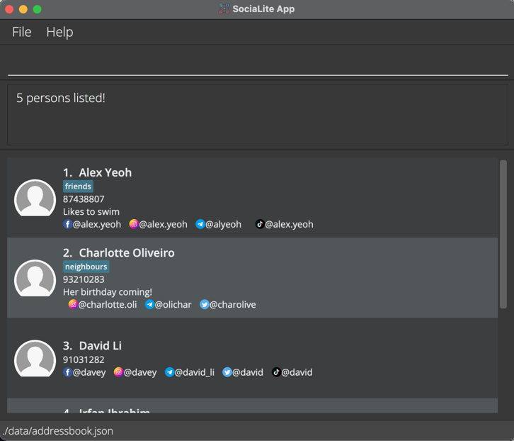
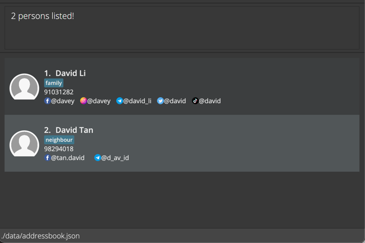
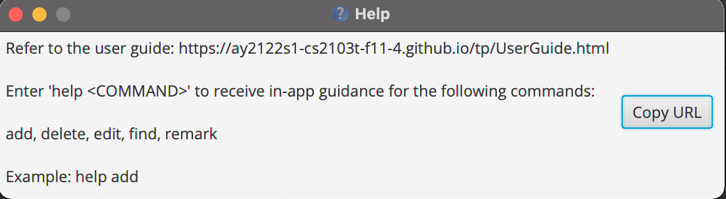
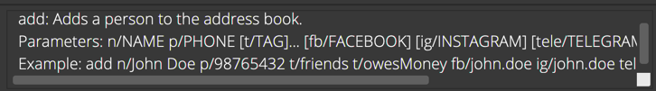

Hello there, fellow SociaLites! Welcome to the User Guide for __SociaLite__, a Command Line Interface (CLI) app that connects you with your contact's social media pages! 

You may be a first-time user trying to set up SociaLite or a returning user hoping to explore advanced features. Fret not, all you need to know about this app can be found in this User Guide! 
Do have a look at our Table of Contents to locate the help you need! 

**Table of Contents**
1. [Quick Start](#quick_start)
2. [Features](#features)
    1. [Basic Functionality](#basic_functionality)
        1. Adding a person: `add`
        2. Listing all persons: `list`
        3. Editing a person: `edit`
        4. Locating persons by name: `find`
        5. Accessing a contact's social media page
        6. Deleting a person: `delete`
        7. Track history of commands: `UP/DOWN` keys
    2. [Organisation of Contacts](#organisation)
        1. Create / Edit tags for existing contacts: `edit INDEX [t/TAG]...`
        2. Query contacts based on tags: `find t/TAG`
        3. Delete tags associated with contacts: `edit INDEX t/`
        4. Add / Edit social media handles for existing contacts: `edit INDEX [p/PLATFORM]`
        5. Query contacts based on social media platform: `find p/PLATFORM`
        6. Sharing a contact card: `share`
        7. Pinning a contact card: `pin`
        8. Unpinning a contact card: `unpin`
    3. [Customisation Tools](#customisation)
       1. Adding remarks about a specific contact: `remark`
       2. Adding/ Changing a profile picture: `picture INDEX`
    4. [Help Guide and Exiting](#help_guide)
       1. Viewing help: `help`
       2. Viewing in-app guidance: `help COMMAND`
       3. Remove all data: `clear`
       4. Exiting the program: `exit`
       5. Saving the data
       6. Editing the data file
3. [Coming Soon](#coming_soon)
   1. Set reminders for a specific contact: `remind`
   2. Adding dates of special occasions associated with a specific contact: `date`
4. [FAQ](#faq)
5. [Command Summary](#summary) 

--------------------------------------------------------------------------------------------------------------------

## Quick Start <a name="quick_start"></a>

1. Ensure you have `Java 11` or above installed on your Computer.
   If you already have `Java` installed, you might want to type in `java -version` in your command window to ensure you are running on the correct version of `Java`!
   If you don't have `Java 11`, simply click [here](https://www.oracle.com/java/technologies/downloads/), and navigate to the "Java SE Development Kit 11.*.**" section to download the latest Java Development Kit.
2. Download the latest `socialite.jar` from [here](https://github.com/AY2122S1-CS2103T-F11-4/tp/releases).
3. Copy the file to the folder you want to use as the _home folder_ for your SociaLite.
4. Double-click the file to start the app. SociaLite should start in a few seconds! The app contains some sample data for you to experiment with to get familiar with the commands.<br>
   
5. Type the command in the command box and press Enter to execute it. e.g. typing **`help`** and pressing Enter will open the help window.<br>
   Here are some sample commands to get you started with SociaLite:

   * **`add`** `add n/Alex Yeoh p/87438807 t/friends fb/alex.yeoh ig/alex.yeoh tele/alyeoh tiktok/alex.yeoh`: Adds a contact named `Alex Yeoh` to SociaLite.

   * **`find`** `find Alex` : Searches SociaLite for a contact named `Alex` and displays the contact's information.

   * **`list`** : Displays all contacts stored on SociaLite.

   * **`edit`** `edit 1 n/Alexis Yeoh` : Edits the name of the contact at the first position of the list to `Alexis Yeoh`.

   * **`delete`**`3` : Deletes the 3rd contact shown in the current list.

   * **`clear`** : Deletes all contacts. You will find this handy when deleting the sample contacts stored on SociaLite.

   * **`exit`** : Exits the app.
6. Refer to the [Features](#features) below for details of each command.

--------------------------------------------------------------------------------------------------------------------

## Features <a name="features"></a> 

<div markdown="block" class="alert alert-info">

**:information_source: Hold your horses SociaLites! Before you venture any further, here are some standard notations for you to take note of:**<br>

* You provide words in `UPPER_CASE` as input.<br>
  e.g. in `add n/NAME`, `NAME` is an input which can be used as `add n/John Doe`.

* Items in square brackets are optional.<br>
  e.g `n/NAME [t/TAG]` can be used as `n/John Doe t/friend` or as `n/John Doe`.

* Items with `…`​ after them can be used any number of times.<br>
  e.g. `[t/TAG]…​` can be used as ` ` (i.e. 0 times), `t/friend`, `t/friend t/family` etc.

* You may type your inputs in any order.<br>
  e.g. if the command specifies `n/NAME p/PHONE_NUMBER`, `p/PHONE_NUMBER n/NAME` is also acceptable.

* If an input for a particular field is expected only once in the command but you specified it multiple times, only the last occurrence of the input will be taken.<br>
  e.g. if you specify `p/12341234 p/56785678`, only `p/56785678` will be taken.

* If you type inputs for commands that do not require any additional information (such as `list`, `exit` and `clear`), they will be ignored.<br>
  e.g. if the command specifies `list 123`, it will be interpreted as `list`.

</div>


<div markdown="block" class="alert alert-danger">


HELLO THERE THIS IS A TEST MESSAGE

This is another message
</div>

<div class="d-flex alert alert-info">
<div class="mr-3">
    <span class="badge badge-dark">FORMAT</span>
</div>
<div markdown="1" class="w-100">
```text
add
```

<div class="d-flex alert alert-danger">
<div class="mr-3">
    <span class="badge badge-dark">EXAMPLE</span>
</div>
<div markdown="1" class="w-100">
```text
add n/John James p/91234567
```
Add a new contact called "John James" with phone number "91234567" to SociaLite.
</div>
</div>

</div>
</div>


--------------------------------------------------------------------------------------------------------------------

## Basic Functionality <a name="basic_functionality"></a>

### Adding a person: `add`

Adds a person to the address book.

Format: `add n/NAME p/PHONE_NUMBER [t/TAG]…​ [date/NAME:YYYY-MM-DD[:monthly|:yearly]]…​ [fb/FACEBOOK] [ig/INSTAGRAM] [tele/TELEGRAM] [tiktok/TIKTOK] [twitter/TWITTER]`

<div markdown="span" class="alert alert-primary">:bulb: **Tip:**
A person can have any number of tags and dates (including 0).
</div>

Examples:
* `add n/Alex Yeoh p/87438807 t/friends fb/alex.yeoh ig/alex.yeoh tele/alyeoh tiktok/alex.yeoh date/birthday:2000-01-01:yearly`
* `add n/Charlotte Oliveiro p/93210284 t/neighbours fb/charlotte.oli tele/olichar twitter/charolive date/wedding anniversary:2020-01-01:yearly`

<br>

### Listing all persons : `list`

Shows a list of all persons in the address book.

Format: `list`

<br>

### Editing a person : `edit`

Edits an existing person in the address book.

Format: `edit INDEX [n/NAME] [p/PHONE] [r/REMARK] [t/TAG]…​ [date/NAME:YYYY-MM-DD[:monthly|:yearly]]…​ [fb/FACEBOOK] [ig/INSTAGRAM] [tele/TELEGRAM] [tiktok/TIKTOK] [twitter/TWITTER]`

* Edits the person at the specified `INDEX`. The index refers to the index number shown in the displayed person list. The index **must be a positive integer** 1, 2, 3, …​
* At least one of the optional fields must be provided.
* Users can opt to change any fields associated with a contact as long as they prepend the argument with the corresponding flags according to the format above.
* Existing values will be updated to the input values.
* When editing tags, the existing tags of the person will be removed i.e adding of tags is not cumulative.
* You can remove all the person’s tags by typing `t/` without
    specifying any tags after it.
* When editing dates, all existing dates of the person will be removed i.e adding of dates is not cumulative.
* You can remove all the person’s dates by typing `date/` without
  specifying any tags after it.

Examples:
*  `edit 1 p/91234567 fb/Yalex19` Edits the phone number and Facebook handle of the 1st person to be `91234567` and `Yalex19` respectively.
*  `edit 2 n/Betsy Crower t/` Edits the name of the 2nd person to be `Betsy Crower` and clears all existing tags.

<br>

### Locating persons by name: `find`

Finds persons whose names contain any of the given keywords.

Format: `find KEYWORD [MORE_KEYWORDS]`

* The search is case-insensitive. e.g `hans` will match `Hans`
* The order of the keywords does not matter. e.g. `Hans Bo` will match `Bo Hans`
* Only full words will be matched e.g. `Han` will not match `Hans`
* Only the name is searched when no flags are provided as input.

Examples:
* `find david` returns `David Li` and `David Tan`
* 

<br>

### Accessing a contact's social media page

Clicking on a contact's social media handle will immediately launch the user's default browser and open the contact's social media profile.

Example:
* Clicking on `@tan.david` will launch the user's default browser and bring the user to David Tan's Facebook page.

<br>

### Deleting a person : `delete`

Deletes the specified person from the address book.

Format: `delete INDEX`

* Deletes the person at the specified `INDEX`.
* The index refers to the index number shown in the displayed person list.
* The index **must be a positive integer** 1, 2, 3, …​

Examples:
* `list` followed by `delete 2` deletes the 2nd person in the address book.
* `find Betsy` followed by `delete 1` deletes the 1st person in the results of the `find` command.

<br>

### Track history of commands: `UP/DOWN` keys

Scroll through your history of commands using the `UP` or `DOWN` keys.

Format: `UP` or `DOWN`

Examples:
* `UP` backtracks to the previous command provided as input.
* `DOWN` advances to subsequent commands stored in history.

--------------------------------------------------------------------------------------------------------------------

## Organisation of Contacts <a name="organisation"></a>

### Create / Edit tags for existing contacts: `edit INDEX [t/TAG]...`

Modifies tags that are associated with existing contacts in the address book.

Format: `edit INDEX [t/TAG]...`
* Adds new tags to persons who did not have tags associated with them when they were first added to SociaLite.
* Deletes all existing tags for the person at the specified `INDEX` and replaces them with tags specified in `[t/TAG]...`
* The index refers to the index number shown in the displayed person list.
* The index **must be a positive integer** 1, 2, 3, …​

Examples:
* `edit 1 t/family` Creates a tag called `family` for the first person in the address book.
* `edit 2 t/friend t/neighbour` Creates tags called `friend` and `neighbour` for the second person in the address book.

<br>

### Query contacts based on tags: `find t/TAG`

Displays the contacts that are associated with a particular tag.

Format: `find t/TAG`
* Queries all contacts that are tied to `TAG`.
* The tag must be existent and associated with certain contacts in the address book.

Examples:
* `find t/family` Checks all contacts in the address book which the user categorises as “family”.
* `find t/work` Checks all contacts in the address book which the user categorises as “work”. 

<br>

### Delete tags associated with contacts: `edit INDEX t/`

Deletes tags that are associated with contacts in the address book.

Format: `edit INDEX t/`
* Deletes all categories tagged to the person at the specified `INDEX`.
* The index refers to the index number shown in the displayed person list.
* The index **must be a positive integer** 1, 2, 3, …​

Examples:
* `edit 2 t/` Deletes all tags associated with the 2nd person in the address book.

<br>

### Add / Edit social media handles for existing contacts: `edit INDEX [fb/FACEBOOK] [ig/INSTAGRAM] [tele/TELEGRAM] [tiktok/TIKTOK] [twitter/TWITTER]`

Modifies social media handles that are associated with existing contacts in the address book.

Format: `edit INDEX [fb/FACEBOOK] [ig/INSTAGRAM] [tele/TELEGRAM] [tiktok/TIKTOK] [twitter/TWITTER]`
* Adds a new handle for contacts who did not have that specific handle pegged with them when they were first added to SociaLite.
* Replaces the handle for the person at the specified `INDEX` according to the flag and input provided.
* The index refers to the index number shown in the displayed person list.
* The index **must be a positive integer** 1, 2, 3, …​
* The flag refers to any of the following: `fb/` `ig/` `tele/` `tiktok/` `twitter/`
* User input after the given flag represents the new social media handle associated with the contact.
* Only social media handles specified as input will be altered. Other social media handles remain unchanged.

Examples:
* `edit 1 fb/alvin.chipmunk` Adds the Facebook handle `alvin.chipmunk` to the first person in the displayed person list.
* `edit 1 tele/alv_1_N` Adds the Telegram handle tags called `alv_1_N` to the first person in the displayed person list. The Facebook handle that was previously added is unaffected.

<br>

### Add / Edit dates of occasions associated with contacts: `edit INDEX [date/NAME:YYYY-MM-DD[:monthly|:yearly]]…​`
Adds dates of occasions (birthdays, appointments) associated with a contact.

Format: `edit INDEX [date/NAME:YYYY-MM-DD[:monthly|:yearly]]…​`
* Adds a date for the contact at the specified `INDEX`.
* The index refers to the index number shown in the displayed person list.
* The index **must be a positive integer** 1, 2, 3, …​
* Dates can have a name to associate them with a specific event (eg. Birthday, Meetup, Anniversary).
* Date must be presented in `YYYY-MM-DD` format.
* Dates can be recurring, either monthly or yearly, by adding `:monthly` or `:yearly` behind the date.
* Each call of `edit INDEX [date/NAME:YYYY-MM-DD[:monthly|:yearly]]…​` will replace all previous dates.
* Using the command `edit INDEX date/` will remove all dates from the user.
* Upcoming dates (within 7 days) will be highlighted in the user interface.

Examples:
* `list` followed by `edit 1 date/Meeting:2021-09-14` adds the event “Meeting” which falls on 14 Sep 2021, to Annie Baker’s listing in the app.
* `find Annie` followed by `edit 1 date/Lunch Appointment:2021-10-10` adds the event “Lunch Appointment” which falls on 10 Oct 2021 to Annie Baker’s listing.

### Query contacts based on social media platform: `find p/PLATFORM`

Show all contacts with their handles on the particular social media platform.

Format: `find p/PLATFORM`
* The social media platform must be supported by SociaLite, e.g. `facebook`, `instagram`, `telegram`, `tiktok`, `twitter`.

Examples:
* `find p/instagram` Returns all contacts who have an Instagram handle pegged with them.
* `find p/twitter` Returns all contacts who have a Twitter handle pegged with them.

<br>

### Sharing a contact card: `share`

Copies the contact card of the specified person to the system clipboard. The user can paste the plain text in an email or text message and forward the contact card to others thereafter.

Alternatively, the user can click on the "Share" button at the top-right hand corner of the contact card that he/she would like to share instead of entering the command.

Format: `share INDEX`

* Copies the contact card of the person at the specified `INDEX` to the system clipboard.
* The index refers to the index number shown in the displayed person list.
* The index **must be a positive integer** 1, 2, 3, …​

Examples:

* `list` followed by `share 2` copies the information of the second contact in the list displayed by SociaLite.
* Clicking on the "Share" button of Annie Baker's name card copies her contact information.

<br>

### Pinning a contact card: `pin`

Affixes the contact card of the specified person onto the top of the person list. Pinned contact cards will be alphabetically ordered.

Alternatively, the user can click on the "Pin" button at the top-right hand corner of the contact card that he/she would like to pin instead of entering the command.

Format: `pin INDEX`

* Pins the contact card of the person at the specified `INDEX` at the top of the person list.
* The index refers to the index number shown in the displayed person list.
* The index **must be a positive integer** 1, 2, 3, ...
* The contact card must **not** be previously pinned.

Examples:

* Provided no contact card has been pinned yet, `list` followed by `pin 3` places the third contact in the list displayed by SociaLite at the top of the person list along with other pinned contacts.
* Clicking on the "Pin" button of Annie Baker's name card affixes her contact card onto the top of the person list.

<br>

### Unpinning a contact card: `unpin`

Removes the contact card of the specified person from the top of the person list.

Alternatively, the user can click on the "Unpin" button at the top-right hand corner of the contact card that he/she would like to unpin instead of entering the command.

Format: `unpin INDEX`

* Unpins the contact card of the person at the specified `INDEX` at the top of the person list.
* The index refers to the index number shown in the displayed person list.
* The index **must be a positive integer** 1, 2, 3, ...
* The contact card must be previously pinned.

Examples:

* Provided the first 4 contact cards are the pinned contact cards, `list` followed by `unpin 2` unpins the second contact in the list displayed by SociaLite.
* Clicking on the "Unpin" button of Charlie Decker's name unpins his contact card if it was previously pinned.


--------------------------------------------------------------------------------------------------------------------

## Customisation Tools <a name="customisation"></a>
For the purpose of illustrating examples in this section, assume that the following contacts exist within the user’s app:
1. Annie Baker
2. Charlie Decker

### Adding remarks about a specific contact: `remark`

Adds special notes about a contact.

Format: `remark INDEX r/[TEXT]`
* Adds a note about the contact at the specified `INDEX`.
* The index refers to the index number shown in the displayed person list.
* The index **must be a positive integer** 1, 2, 3, …​

Examples:
* `list` followed by `remark 2 r/Doesn’t like vegetables`  adds the remark “Doesn’t like vegetables” to Charlie Decker’s listing in the address book.
* `find Annie` followed by `remark 1 r/Loves peas` adds the remark “Loves peas” to Annie Baker’s listing in the app.

<br>

### Adding/ Changing a profile picture: `picture`
Adds a profile picture to an existing contact or changes the existing profile picture if available.

Format: `picture INDEX`
* Opens file browser allowing you to choose any .jpg or .png file as the profile picture.
* Adds the selected picture to the contact at the specified `INDEX`.
* The index refers to the index number shown in the displayed person list.
* The index **must be a positive integer** 1, 2, 3, …​

Examples:
* `list` followed by `picture 1` opens the file browser to let you choose a picture to add to Annie Baker’s
  listing in the app.
* `find Charlie` followed by `picture 1` opens the file browser to let you choose a picture to add to Charlie Decker’s listing in the app.

--------------------------------------------------------------------------------------------------------------------

## Help Guide & Exiting <a name="help_guide"></a>

### Viewing help: `help`
Shows a message explaining how to access the User Guide or obtain in-app guidance for selected commands.

Format: `help`



<br>

### Viewing in-app guidance: `help COMMAND`

Displays concise instructions for users to learn the given `COMMAND`'s function.

Format: `help COMMAND`
* Acceptable keywords to use in `COMMAND`: `add` `delete` `edit` `find` `remark` `share` `picture` `pin` `unpin`

Examples:
* `help add` displays a concise guide on how to use the `add` command.
* `help edit` displays a concise guide on how to use the `edit` command.

  

<br>

### Remove all data: `clear`
Removes all contacts in the app.

Format: `clear`

<div markdown="span" class="alert alert-warning">:exclamation: **Caution:**
Please be mindful that entering this command will wipe out all your contacts stored in SociaLite!
</div>

<br>

### Exiting the program : `exit`

Exits the program.

Format: `exit`

<br>

### Saving the data

SociaLite data are saved in the hard disk automatically after any command that changes the data. There is no need to save manually.

<br>

### Editing the data file

SociaLite data are saved as a JSON file `[JAR file location]/data/SociaLite.json`. Advanced users are welcome to update data directly by editing that data file.

<div markdown="span" class="alert alert-warning">:exclamation: **Caution:**
If your changes to the data file makes its format invalid, SociaLite will discard all data and start with an empty data file at the next run.
</div>

--------------------------------------------------------------------------------------------------------------------

## FAQ <a name="faq"></a>

**Q**: How do I transfer my data to another Computer?<br>
**A**: Install the app in the other computer and overwrite the empty data file it creates with the file that contains the data of your previous SociaLite home folder.

--------------------------------------------------------------------------------------------------------------------

## Command summary <a name="summary"></a>

Action | Format, Examples
--------|------------------
**Add** | `add n/NAME p/PHONE_NUMBER [t/TAG]…​ [date/NAME:YYYY-MM-DD[:monthly|:yearly]]…​ [fb/FACEBOOK] [ig/INSTAGRAM] [tele/TELEGRAM] [tiktok/TIKTOK] [twitter/TWITTER]` <br> e.g., `add n/Alex Yeoh p/87438807 t/friends fb/alex.yeoh ig/alex.yeoh tele/alyeoh tiktok/alex.yeoh`
**List** | `list`
**Edit** | `edit INDEX [n/NAME] [p/PHONE] [r/REMARK] [t/TAG]…​ [date/NAME:YYYY-MM-DD[:monthly|:yearly]]…​ [fb/FACEBOOK] [ig/INSTAGRAM] [tele/TELEGRAM] [tiktok/TIKTOK] [twitter/TWITTER]` <br> e.g., `edit 1 p/91234567 fb/Yalex19`
**Find Contact** | `find KEYWORD [MORE_KEYWORDS]`<br> e.g., `find James Jake`
**Access Social Media Page** | Click on social media handle
**Delete** | `delete INDEX`<br> e.g., `delete 3`
**Track History** | `UP` or `DOWN` arrow keys
**Create / Edit Categories** | `edit INDEX [t/TAG]...` <br> e.g., `edit 1 t/Friends`
**Query Category** | `find t/TAG` <br> e.g., `find t/Friends`
**Delete Category** | `edit INDEX t/`
**Add / Edit Social Media Handles** | `edit INDEX [p/PLATFORM]` <br> e.g., `edit 1 fb/Alv1n.y`
**Query Contacts via Platform** | `find p/PLATFORM` <br> e.g., `find p/facebook`
**Share Contact** | `share INDEX` <br> e.g. `share 2`
**Pin Contact** | `pin INDEX`<br />e.g. `pin 4` 
**Unpin Contact** | `unpin INDEX`<br>e.g. `unpin 1` 
**Add Remark** | `remark INDEX r/[TEXT]` <br> e.g., `remark 1 r/Likes to swim`
**Add/ Change Profile Picture** | `picture INDEX`
**View Help** | `help`
**View In-App Guidance** | `help COMMAND` <br> e.g., `help add`
**Remove All Data** | `clear`
**Exit** | `exit`
