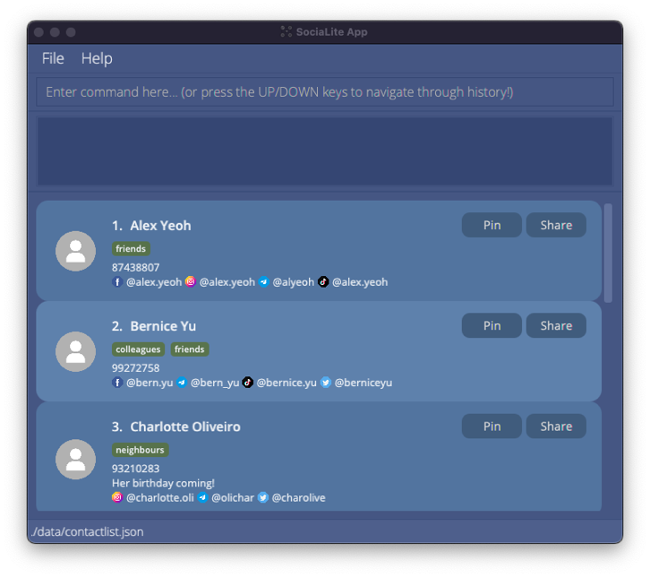
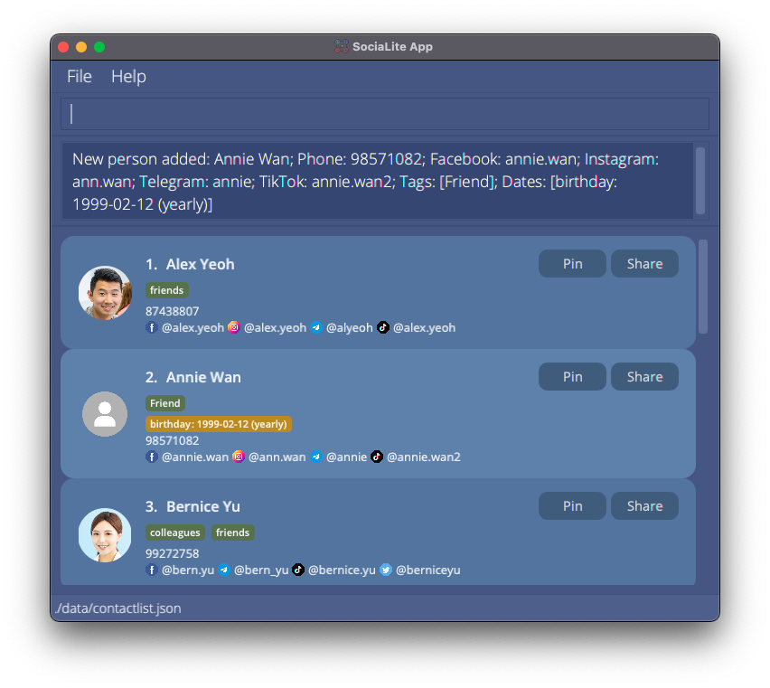
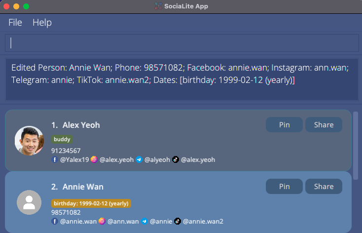
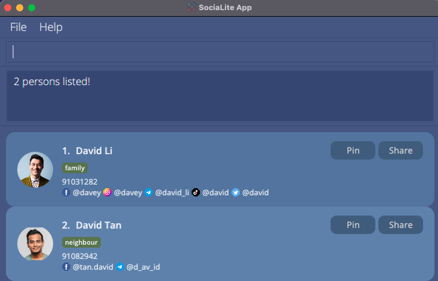
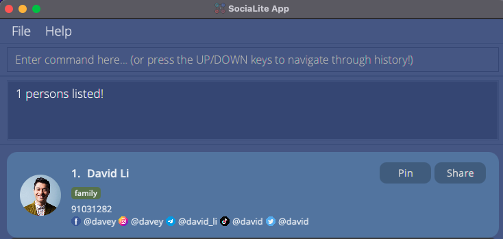
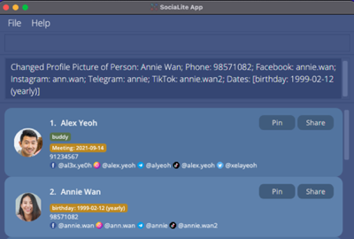
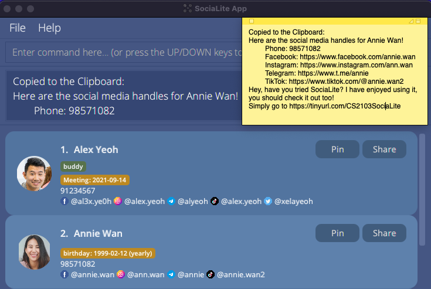
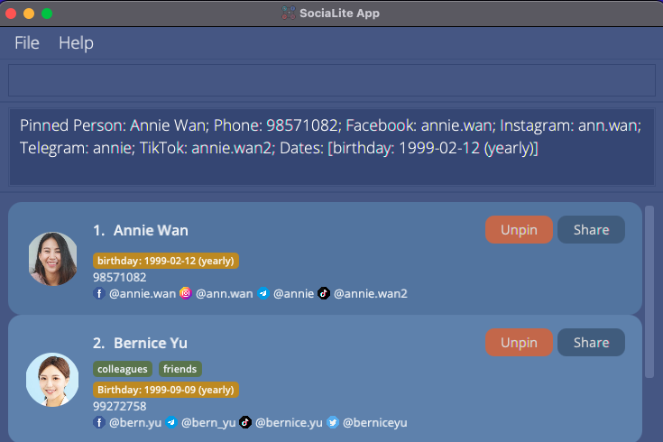
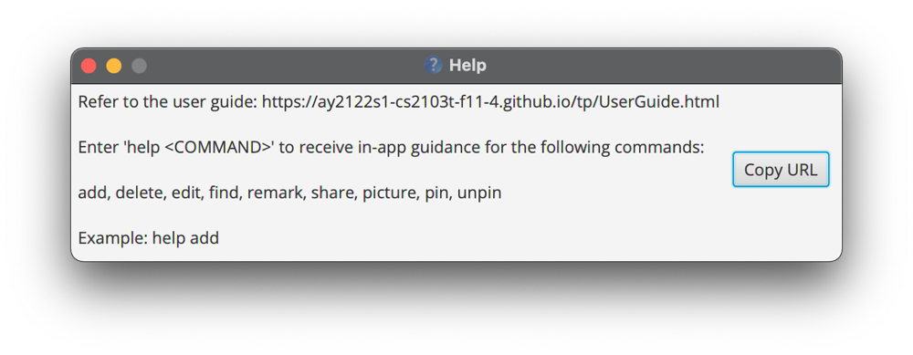
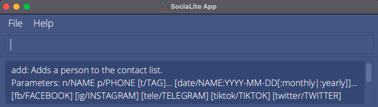

Hello there, fellow SociaLites! Welcome to the User Guide for __SociaLite__, a Command Line Interface (CLI) app that connects you with your contact's social media pages! 

You may be a first-time user trying to set up SociaLite or a returning user hoping to explore advanced features. Fret not, all you need to know about this app can be found in this User Guide!
Simply follow the path that corresponds to your needs.

| If you are a...| You should...                                                            |
| -------------- | ------------------------------------------------------------------------ |
| new user       | View our [Quick Start](#quick_start) guide to set up SociaLite and try out the features. |
| returning user | Jump straight to our [Commands](#commands) section to recall how our features work!   |

--------------------------------------------------------------------------------------------------------------------
## Navigation Menu

**[Quick Start](#quick_start)** 
This section teaches you how to install **SociaLite** and includes sample commands for you to try out.

**[Standard Notations](#standard_notations)** 
This section teaches you how to interpret instructions in this User Guide.

**[Commands](#commands)** 
This section gives you comprehensive details of all the commands on SociaLite.

**[FAQ](#faq)** 
This section answers frequently asked questions about SociaLite.

**[Command Index](#index)** 
This section contains a glossary of all the commands and quick examples for reference.

 

--------------------------------------------------------------------------------------------------------------------

## Quick Start 

1. Ensure you have `Java 11` or above installed on your Computer.
   If you already have `Java` installed, you might want to type in `java -version` in your command window to ensure you are running on the correct version of `Java`!
   If you don't have `Java 11`, simply click [here](https://www.oracle.com/java/technologies/downloads/), and navigate to the "Java SE Development Kit 11.x.xx" section to download the latest Java Development Kit.
2. Download the latest `socialite.jar` from [here](https://github.com/AY2122S1-CS2103T-F11-4/tp/releases).
3. Copy the file to the folder you want to use as the _home folder_ for your SociaLite.
4. Double-click the file to start the app. SociaLite should start in a few seconds! The app contains some sample data for you to experiment with to get familiar with the commands. 
   
5. Type the command in the command box and press Enter to execute it. e.g. typing **`help`** and pressing Enter will open the help window. 
   Here are some sample commands to get you started with SociaLite:

   * **`add`** `add n/Alex Yeoh p/87438807 t/friends fb/alex.yeoh ig/alex.yeoh tele/alyeoh tiktok/alex.yeoh`: Adds a contact named `Alex Yeoh` to SociaLite.

   * **`find`** `find Alex` : Searches SociaLite for a contact named `Alex` and displays the contact's information.

   * **`list`** : Displays all contacts stored on SociaLite.

   * **`edit`** `edit 1 n/Alexis Yeoh` : Edits the name of the contact at the first position of the list to `Alexis Yeoh`.

   * **`delete`** `delete 3` : Deletes the 3rd contact shown in the current list.

   * **`clear`** : Deletes all contacts. You will find this handy when deleting the sample contacts stored on SociaLite.

   * **`exit`** : Exits the app.
6. Refer to the [Commands](#commands) below for details of each command.

--------------------------------------------------------------------------------------------------------------------

 
 
 
 
 
 
 
 
 
 
 
 
 
 
 
 
 
 
 
 
 
 
 
 
 
 
 
 
 
 
 
 
 
 

## Standard Notations  

**:information_source: Hold your horses SociaLites! Before you venture any further, here are some standard notations for you to take note of:** 

* You provide words in `UPPER_CASE` as input. 
  e.g. in `add n/NAME`, `NAME` is an input which can be used as `add n/John Doe`.

* Items in square brackets are optional. 
  e.g. `n/NAME [t/TAG]` can be used as `n/John Doe t/friend` or as `n/John Doe`.

* Items with `…`​ after them can be used any number of times. 
  e.g. `[t/TAG]…​` can be used as ` ` (i.e. 0 times), `t/friend`, `t/friend t/family` etc.

* The `|` vertical bar indicates a choice that you have to make between the left and right options. 
  e.g. in `[date/NAME:YYYY-MM-DD[:monthly|:yearly]]`, you can enter `date/Birthday:2021-01-01:yearly` to indicate an annual event called `Birthday` that repeats on 1 Jan yearly.

* You may type your inputs in any order. 
  e.g. if the command specifies `n/NAME p/PHONE_NUMBER`, `p/PHONE_NUMBER n/NAME` is also acceptable.

* If an input for a particular field is expected only once in the command but you specified it multiple times, only the last occurrence of the input will be taken. 
  e.g. if you specify `p/12341234 p/56785678`, only `p/56785678` will be taken.

* If you type inputs for commands that do not require any additional information (such as `list`, `exit` and `clear`), they will be ignored. 
  e.g. if the command specifies `list 123`, it will be interpreted as `list`.

As you explore the features that SociaLite has to offer, look out for these boxes:

The blue boxes tell you the acceptable fields that you can provide for a particular command:

**:mag_right: Format:**
`add n/NAME p/PHONE_NUMBER [t/TAG]…​ [date/NAME:YYYY-MM-DD[:monthly|:yearly]]…​ [fb/FACEBOOK] [ig/INSTAGRAM] [tele/TELEGRAM] [tiktok/TIKTOK] [twitter/TWITTER]`
* Detail 1
* Detail 2

If you still aren't sure of how a particular command works, the green boxes provide you with examples that you can try out:

**:heavy_check_mark: Example:** `add n/Alex Yeoh p/87438807 t/friends fb/alex.yeoh ig/alex.yeoh tele/alyeoh tiktok/alex.yeoh date/birthday:2000-01-01:yearly`

Adds a new contact called "Alex Yeoh" with phone number "87438807" to SociaLite.

--------------------------------------------------------------------------------------------------------------------

## Commands 

This section provides you with comprehensive details of all the commands available on SociaLite. 
Simply click on any command below to learn more about it!

| `COMMAND` | Description |
| --------- | ----------- |
| [`add n/NAME p/PHONE_NUMBER ...`](#add) | Add a contact |
| [`list`](#list) | List all contacts |
| [`CLICK`](#click) | Access a contact's social media page |
| [`↑`/`↓`](#scroll) | Track history of commands |
| [`edit INDEX ...`](#edit) | Edit a contact |
| [`edit INDEX [t/TAG]`](#edit_tag) | Create / Edit tags for existing contacts |
| [`edit INDEX t/`](#delete_tag) | Delete all tags from a contact |
| [`edit INDEX [p/PLATFORM]`](#edit_platform) | Modify social media handles for a contact |
| [`edit INDEX [date/NAME:YYYY-MM-DD[:monthly|:yearly]]…​`](#edit_dates) | Modify dates for a contact |
| [`delete INDEX`](#delete) | Delete a contact |
| [`clear`](#clear) | Delete all contacts |
| [`find NAME`](#find) | Find a contact by name |
| [`find t/TAG`](#find_tag) | Find a contact through associated tags |
| [`find p/PLATFORM`](#find_platform) | Find a contact through associated social media platforms |
| [`picture INDEX`](#picture) | Modify profile picture of a contact |
| [`share INDEX`](#share) | Copy contact information to system clipboard |
| [`pin INDEX`](#pin) | Pin contact card on the top of the person list |
| [`unpin INDEX`](#unpin) | Unpin contact card from the top of the person list |
| [`remark INDEX r/[TEXT]`](#remark) | Add special notes about a contact |
| [`help`](#help) | Access User Guide |
| [`help COMMAND`](#help_command) | Access in-app guidance for selected commands |
| [`exit`](#exit) | Exit the program |

 
 
 
 
 
 
 
 
 
 
 
 
 
 
 
 
 
 
 
 
 
 
 
 
 
 
 
 
 
 
 
 
 
 
 
 
 

### Add a person: `add n/NAME p/PHONE_NUMBER ...` 

Adds a person to SociaLite.

**:mag_right: Format:**
`add n/NAME p/PHONE_NUMBER [t/TAG]…​ [date/NAME:YYYY-MM-DD[:monthly|:yearly]]…​ [fb/FACEBOOK] [ig/INSTAGRAM] [tele/TELEGRAM] [tiktok/TIKTOK] [twitter/TWITTER]`
* A person can have any number of tags and dates (including 0).
* To add a contact to SociaLite, you need to provide the **name** and a **unique phone number** for the person!

**:heavy_check_mark: Example:** `add n/Annie Wan p/98571082 t/Friend fb/annie.wan ig/ann.wan tele/annie tiktok/annie.wan2 date/birthday:1999-02-12:yearly`

Adds a new contact called "Annie Wan" with phone number "98571082" to SociaLite.

**:heavy_check_mark: Example:** `add n/David Tan p/91082942 t/neighbour fb/tan.david tele/d_av_id`

Adds a new contact called "David Tan" with phone number "91082942" to SociaLite.

 

### List all persons : `list` 

Shows a list of all persons stored on SociaLite.

**:mag_right: Format:**
`list`

 

### Access a contact's social media page 

Clicking on a contact's social media handle will immediately launch the user's default browser and open the contact's social media profile.

**:heavy_check_mark: Example:** 
Clicking on the Facebook handle `@alex.yeoh` launches the user's default browser and brings the user to Alex Yeoh's Facebook page.

 

### Track history of commands: `↑` or `↓` arrow keys 

Scroll through your history of commands using the `↑` or `↓` arrow keys.

**:mag_right: Format:**
`↑` or `↓`

**:heavy_check_mark: Example:** `↑` backtracks to the previous command provided as input.

**:heavy_check_mark: Example:** `↓` advances to subsequent commands stored in history.

 
 
 
 
 
 
 

### Edit a person : `edit INDEX ...` 

Edits an existing contact on SociaLite.

**:mag_right: Format:**
`edit INDEX [n/NAME] [p/PHONE] [r/REMARK] [t/TAG]…​ [date/NAME:YYYY-MM-DD[:monthly|:yearly]]…​ [fb/FACEBOOK] [ig/INSTAGRAM] [tele/TELEGRAM] [tiktok/TIKTOK] [twitter/TWITTER]`
* Edits the person at the specified `INDEX`. The index refers to the index number shown on the displayed person list. 
* The index **must be a positive integer** 1, 2, 3, …​
* At least one of the optional fields must be provided.
* Users can opt to change any fields associated with a contact as long as they prepend the argument with the corresponding flags according to the format above.
* Existing values will be updated to the input values.
* When editing tags, the existing tags of the person will be removed i.e adding of tags is not cumulative.
* You can remove all the person’s tags by typing `t/` without
    specifying any tags after it.
* When editing dates, all existing dates of the person will be removed i.e adding of dates is not cumulative.
* You can remove all the person’s dates by typing `date/` without
  specifying any tags after it.

**:heavy_check_mark: Example:** `edit 1 p/91234567 fb/Yalex19` 

Edits the phone number and Facebook handle of the 1st person to be `91234567` and `Yalex19` respectively.

**:heavy_check_mark: Example:** `edit 4 n/Betsy Crower t/`

Edits the name of the 4th person to be `Betsy Crower` and clears all existing tags.

 

### Create / Edit tags for existing contacts: `edit INDEX [t/TAG]...` 

Modifies tags that are associated with existing contacts stored on SociaLite.

**:mag_right: Format:**
`edit INDEX [t/TAG]...`
* Adds new tags to persons who did not have tags associated with them when they were first added to SociaLite.
* Deletes all existing tags for the person at the specified `INDEX` and replaces them with tags specified in `[t/TAG]...`
* Each tag can only be up to 50 characters long.
* The index refers to the index number shown on the displayed person list.
* The index **must be a positive integer** 1, 2, 3, …​

**:heavy_check_mark: Example:** `edit 1 t/buddy`

Creates a tag called `buddy` for the first person on the displayed person list.

**:heavy_check_mark: Example:** `edit 2 t/friend t/neighbour`

Creates tags called `friend` and `neighbour` for the second person on the displayed person list.

 
 
 
 
 
 
 
 

### Delete tags associated with contacts: `edit INDEX t/` 

Deletes all tags that are associated with a specified contact on SociaLite.

**:mag_right: Format:**
`edit INDEX t/`
* Deletes all categories tagged to the person at the specified `INDEX`.
* The index refers to the index number shown on the displayed person list.
* The index **must be a positive integer** 1, 2, 3, …​

**:heavy_check_mark: Example:** `edit 2 t/` 

Deletes all tags associated with the 2nd person on the displayed person list.

 
 
 
 
 
 
 
 
 
 
 
 

### Add / Edit social media handles for existing contacts: `edit INDEX [fb/FACEBOOK] [ig/INSTAGRAM] [tele/TELEGRAM] [tiktok/TIKTOK] [twitter/TWITTER]` 

Modifies social media handles that are associated with existing contacts on SociaLite.

**:mag_right: Format:**
`edit INDEX [fb/FACEBOOK] [ig/INSTAGRAM] [tele/TELEGRAM] [tiktok/TIKTOK] [twitter/TWITTER]`
* Adds a new handle for contacts who did not have that specific handle pegged with them when they were first added to SociaLite.
* Replaces the handle for the person at the specified `INDEX` according to the flag and input provided.
* The index refers to the index number shown on the displayed person list.
* The index **must be a positive integer** 1, 2, 3, …​
* The flag refers to any of the following: `fb/` `ig/` `tele/` `tiktok/` `twitter/`
* User input after the given flag represents the new social media handle associated with the contact.
* Only social media handles specified as input will be altered. Other social media handles remain unchanged.

**:heavy_check_mark: Example:** `edit 1 fb/al3x.ye0h` 

Changes the Facebook handle of the first person on the displayed person list to `al3x.ye0h`.

**:heavy_check_mark: Example:** `edit 1 twitter/xelayeoh` 

Adds the Twitter handle called `xelayeoh` to the first person on the displayed person list. The Facebook handle that was previously modified is unaffected.

 

### Add / Edit dates of occasions associated with contacts: `edit INDEX [date/NAME:YYYY-MM-DD[:monthly|:yearly]]…​` 

Adds / Edits dates of occasions (birthdays, appointments) associated with a contact.

**:mag_right: Format:**
`edit INDEX [date/NAME:YYYY-MM-DD[:monthly|:yearly]]…​`
* Adds a date for the contact at the specified `INDEX`.
* The index refers to the index number shown on the displayed person list.
* The index **must be a positive integer** 1, 2, 3, …​
* Dates can have a name to associate them with a specific event (eg. Birthday, Meetup, Anniversary).
* The name associated with the event can only be up to 50 characters long.
* Date must be presented in `YYYY-MM-DD` format.
* Dates can be recurring, either monthly or yearly, by adding `:monthly` or `:yearly` behind the date.
* Each call of `edit INDEX [date/NAME:YYYY-MM-DD[:monthly|:yearly]]…​` will replace all previous dates.
* Using the command `edit INDEX date/` will remove all dates from the user.
* Upcoming dates (within 7 days) will be highlighted in the user interface.

**:heavy_check_mark: Example:** `list` followed by `edit 1 date/Meeting:2021-09-14` 

Adds the event “Meeting” which falls on 14 Sep 2021, to Alex Yeoh’s listing.

**:heavy_check_mark: Example:** `find Bernice` followed by `edit 1 date/Birthday:1999-09-09:yearly` 

Adds the event “Birthday” which falls on 9 Sep every year to Bernice Yu’s listing.

 

### Delete a person : `delete INDEX` 

Deletes the specified person from SociaLite.

**:mag_right: Format:**
`delete INDEX`
* Deletes the person at the specified `INDEX`.
* The index refers to the index number shown on the displayed person list.
* The index **must be a positive integer** 1, 2, 3, …​

**:heavy_check_mark: Example:** `list` followed by `delete 7` 

Deletes the 7th person on the displayed person list.

**:heavy_check_mark: Example:** `find Roy` followed by `delete 1` 

Deletes the 1st person on the displayed person list of the `find` command.

 

### Remove all data: `clear` 

Removes all contacts in the app.

**:mag_right: Format:**
`clear`

:exclamation: **Caution:**
Please be mindful that entering this command will wipe out all your contacts stored in SociaLite!

 
 
 
 

### Locate contacts by name: `find NAME` 

Finds persons whose names contain any of the given keywords.

**:mag_right: Format:**
`find NAME [MORE_KEYWORDS]`
* The search is case-insensitive.
* The order of the keywords does not matter.
* Supports partial matching from the start of each word in a contact's name.
* Name is searched by default when no flags (or invalid flags) are given as input.

**:heavy_check_mark: Example:** `find david`

Returns `David Li` and `David Tan`  

**:heavy_check_mark: Example:** `find Hans Bo` will match `Bo Hans`

**:heavy_check_mark: Example:** `find han` will match `Hans` but not `Khan`

**:heavy_check_mark: Example:** `find Al Y` will match `Alex Yeoh`

 

### Query contacts based on tags: `find t/TAG` 

Displays the contacts that are associated with a particular tag.

**:mag_right: Format:**
`find t/TAG`
* Queries all contacts that are tied to `TAG`.
* The tag must be existent and associated with certain contacts stored on SociaLite.
* Tags are matched from the start of their names.
* If multiple tags are queried, only contacts possessing all given tags are returned.

**:heavy_check_mark: Example:** `find t/family` 

Checks for contacts which the user categorized as “family”.

**:heavy_check_mark: Example:** `find t/classmate` 

Checks for contacts which the user categorized as “classmate” OR "classmates" etc.

**:heavy_check_mark: Example:** `find t/mates` 

Checks for contacts which the user categorized as “mates” BUT NOT "classmates".

**:heavy_check_mark: Example:** `find t/colleagues t/friends` 

Checks for contacts which are categorized as BOTH “colleagues” AND "friends".

 

### Query contacts based on social media platform: `find p/PLATFORM` 

Show all contacts with their handles on the particular social media platform.

**:mag_right: Format:**
`find p/PLATFORM`
* The social media platform entered must be supported by SociaLite, 
(i.e.: Only `facebook`, `instagram`, `telegram`, `tiktok`, `twitter` are accepted, case insensitive).
* If multiple platforms are queried, only contacts with handles for ALL specified platforms are returned.

**:heavy_check_mark: Example:** `find p/facebook p/instagram` 

Returns all contacts who have BOTH a Facebook and Instagram handle pegged with them.

**:heavy_check_mark: Example:** `find p/telegram` 

Returns all contacts who have an Telegram handle pegged with them.

 

### Add / Change a profile picture: `picture INDEX` 

Adds a profile picture to an existing contact or changes the existing profile picture if available.

**:mag_right: Format:**
`picture INDEX`
* Opens file browser allowing you to choose any .jpg or .png file as the profile picture.
* Adds the selected picture to the contact at the specified `INDEX`.
* The index refers to the index number shown on the displayed person list.
* The index **must be a positive integer** 1, 2, 3, …​

**:heavy_check_mark: Example:** `list` followed by `picture 2` 

Opens the file browser to let you choose a picture to add to Annie Wan’s listing in the app.

Updates Annie Wan's profile picture in SociaLite.

**:heavy_check_mark: Example:** `find Alex` followed by `picture 1` 

Opens the file browser to let you change the profile picture for Alex Yeoh’s listing in the app.

 
 
 
 
 
 
 
 
 
 
 
 
 
 
 
 
 
 
 

### Share a contact card: `share INDEX` 

Copies the contact card of the specified person to the system clipboard. The user can paste the plain text in an email or text message and forward the contact card to others thereafter.

Alternatively, the user can click on the "Share" button at the top-right hand corner of the contact card that he/she would like to share instead of entering the command.

**:mag_right: Format:**
`share INDEX`
* Copies the contact card of the person at the specified `INDEX` to the system clipboard.
* The index refers to the index number shown on the displayed person list.
* The index **must be a positive integer** 1, 2, 3, …​

**:heavy_check_mark: Example:** `list` followed by `share 2` 

Copies the information of the second contact in the list displayed by SociaLite.

**:heavy_check_mark: Example:** Clicking on the "Share" button of Annie Wan's name card copies her contact information.

 
 
 

### Pin a contact card: `pin INDEX` 

Affixes the contact card of the specified person onto the top of the person list. Pinned contact cards will be alphabetically ordered.

Alternatively, the user can click on the "Pin" button at the top-right hand corner of the contact card that he/she would like to pin instead of entering the command.

**:mag_right: Format:**
`pin INDEX`
* Pins the contact card of the person at the specified `INDEX` at the top of the person list.
* The index refers to the index number shown on the displayed person list.
* The index **must be a positive integer** 1, 2, 3, ...
* The contact card must **not** be previously pinned.

**:heavy_check_mark: Example:** `list` followed by `pin 3`

Provided no contact card has been pinned yet, the above command places the third contact in the list displayed by 
SociaLite, at the top of the person list along with other pinned contacts.

**:heavy_check_mark: Example:** Clicking on the "Pin" button of Annie Wan's name card affixes her contact card onto the top of the person list.

 
 
 
 
 
 
 
 
 
 
 
 
 
 
 
 
 
 
 

### Unpin a contact card: `unpin INDEX` 

Removes the contact card of the specified person from the top of the person list.

Alternatively, the user can click on the "Unpin" button at the top-right hand corner of the contact card that he/she would like to unpin instead of entering the command.

**:mag_right: Format:**
`unpin INDEX`
* Unpins the contact card of the person at the specified `INDEX` at the top of the person list.
* The index refers to the index number shown on the displayed person list.
* The index **must be a positive integer** 1, 2, 3, ...
* The contact card must be previously pinned.

**:heavy_check_mark: Example:** `list` followed by `unpin 1` 

Provided the first 2 contact cards are the pinned contact cards, the above command unpins the first contact in the list displayed by SociaLite.

**:heavy_check_mark: Example:** Clicking on the "Unpin" button of Bernice Yu's name unpins her contact card if it was previously pinned.

 

### Add remarks about a specific contact: `remark INDEX r/[TEXT]` 

Adds special notes about a contact.

**:mag_right: Format:**
`remark INDEX r/[TEXT]`

* Adds a short note about the contact at the specified `INDEX`.
* The index refers to the index number shown in the displayed person list.
* The index **must be a positive integer** 1, 2, 3, …
* Remarks must be 150 characters in length or less (inclusive of spaces)

**:heavy_check_mark: Example:** `list` followed by `remark 1 r/Doesn’t like vegetables`

Adds the remark “Doesn’t like vegetables” to Alex Yeoh’s listing in the app.

**:heavy_check_mark: Example:** `find Annie` followed by `remark 1 r/Loves peas r/Allergic to prawns r/Hates carrots`

Only the remark “Hates carrots” is added to Annie Wan’s listing in the app.

 

### View help: `help` 

Shows a message explaining how to access the User Guide or obtain in-app guidance for selected commands.

**:mag_right: Format:**
`help`

 

### View in-app guidance: `help COMMAND` 

Displays concise instructions for users to learn the given `COMMAND`'s function.

**:mag_right: Format:**
`help COMMAND`
* Acceptable keywords to use in `COMMAND`: `add` `delete` `edit` `find` `remark` `share` `picture` `pin` `unpin`

**:heavy_check_mark: Example:** `help add` 

Displays a concise guide on how to use the `add` command.

**:heavy_check_mark: Example:** `help edit` 

Displays a concise guide on how to use the `edit` command.

 

### Exit the program : `exit` 

Exits the program.

**:mag_right: Format:**
`exit`

 

--------------------------------------------------------------------------------------------------------------------

## FAQ 

**Q**: How is my data saved? 
**A**: SociaLite data are saved in the hard disk automatically after any command that alters the data. There is no need to save manually.

**Q**: How do I transfer my data to another Computer? 
**A**: Install the app in the other computer and overwrite the empty data file it creates with the file that contains the data of your previous SociaLite home folder.

**Q**: Can I edit my data? 
**A**: SociaLite data are saved as a JSON file `<JAR file location>/data/SociaLite.json`. Advanced users are welcome to update data directly by editing that data file.

:exclamation: **Caution:**
If your changes to the data file makes its format invalid, SociaLite will discard all data and start with an empty data file at the next run.

--------------------------------------------------------------------------------------------------------------------

## Command Index 

Action | Format | Example (if any)
--------|------------------|--------------------
**Access Social Media Page** | Click on social media handle | 
**Add** | `add n/NAME p/PHONE_NUMBER [t/TAG]…​ [date/NAME:YYYY-MM-DD[:monthly|:yearly]]…​ [fb/FACEBOOK] [ig/INSTAGRAM] [tele/TELEGRAM] [tiktok/TIKTOK] [twitter/TWITTER]` | `add n/Alex Yeoh p/87438807 t/friends fb/alex.yeoh ig/alex.yeoh tele/alyeoh tiktok/alex.yeoh`
**Add / Edit Categories** | `edit INDEX [t/TAG]...` | `edit 1 t/Friends`
**Add / Edit Dates** | `edit INDEX [date/NAME:YYYY-MM-DD[:monthly|:yearly]]…​` | `edit 1 date/Meeting:2021-09-14`
**Add / Edit Profile Picture** | `picture INDEX` | `picture 1`
**Add / Edit Social Media Handles** | `edit INDEX [p/PLATFORM]` | `edit 1 fb/Alv1n.y`
**Add Remark** | `remark INDEX r/[TEXT]` | `remark 1 r/Likes to swim`
**Delete** | `delete INDEX`| `delete 3`
**Delete All Categories** | `edit INDEX t/` | `edit 1 t/`
**Delete All Data** | `clear` |
**Edit** | `edit INDEX [n/NAME] [p/PHONE] [r/REMARK] [t/TAG]…​ [date/NAME:YYYY-MM-DD[:monthly|:yearly]]…​ [fb/FACEBOOK] [ig/INSTAGRAM] [tele/TELEGRAM] [tiktok/TIKTOK] [twitter/TWITTER]` | `edit 1 p/91234567 fb/Yalex19`
**Exit** | `exit` |
**Find Contacts by Category** | `find t/TAG` | `find t/Friends`
**Find Contacts by Name** | `find NAME [MORE_KEYWORDS]`| `find James Jake`
**Find Contacts by Platform** | `find p/PLATFORM` | `find p/facebook`
**List** | `list` |
**Pin Contact** | `pin INDEX` | `pin 4`
**Share Contact** | `share INDEX` | `share 2`
**Track History** | `↑` or `↓` arrow keys |
**Unpin Contact** | `unpin INDEX` | `unpin 1`
**View Help** | `help` |
**View In-App Guidance** | `help COMMAND` | `help add`
