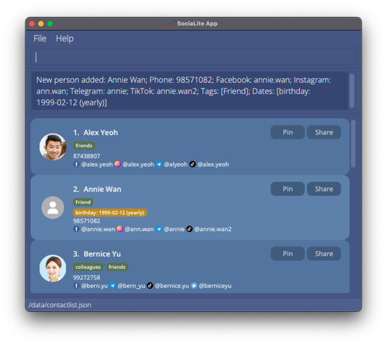

Hello there, fellow SociaLites! Welcome to the User Guide for __SociaLite__, a Command Line Interface (CLI) app that connects you with your contact's social media pages! 

You may be a first-time user trying to set up SociaLite or a returning user hoping to explore advanced features. Fret not, all you need to know about this app can be found in this User Guide!
Simply follow the path that corresponds to your needs.

| If you are a...| You should...                                                            |
| -------------- | ------------------------------------------------------------------------ |
| new user       | View our [Quick Start](#quick_start) guide to set up SociaLite and try out the features. |
| returning user | Jump straight to our [Commands](#commands) section to recall how our features work!   |

--------------------------------------------------------------------------------------------------------------------
## Navigation Menu

**[Quick Start](#quick_start)** 
This section teaches you how to install **SociaLite** and includes sample commands for you to try out.

**[Standard Notations](#standard_notations)** 
This section teaches you how to interpret instructions in this User Guide.

**[Commands](#commands)** 
This section gives you comprehensive details of all the commands on SociaLite.

**[FAQ](#faq)** 
This section answers frequently asked questions about SociaLite.

**[Command Index](#index)** 
This section contains a glossary of all the commands and quick examples for reference.

--------------------------------------------------------------------------------------------------------------------
 

## Quick Start 

1. Ensure you have `Java 11` or above installed on your Computer.
   * If you already have `Java` installed, you might want to type in `java -version` in your command window to ensure you are running on the correct version of `Java`!
   * If you don't have `Java 11`, simply click [here](https://www.oracle.com/java/technologies/downloads/), and navigate to the "Java SE Development Kit 11.x.xx" section to download the latest Java Development Kit.
2. Download the latest `socialite.jar` from our [GitHub release page](https://github.com/AY2122S1-CS2103T-F11-4/tp/releases).
3. Copy the file to the folder you want to use as the home folder for your SociaLite.
4. Double-click the file to start the app. SociaLite should be launched in a few seconds! If you are opening the app for the first time, you will see some sample data for you to experiment with.

5. Type the command in the command box and press **`Enter`** to execute it. E.g. typing **`help`** and pressing **`Enter`** will open the help window.
    Here are some sample commands you can try out to get started with SociaLite:
    
    * **`add`** `add n/Alex Yeoh p/87438807 ig/alex.yeoh`: A contact named `Alex Yeoh` with Instagram handle `alex.yeoh` will be added to SociaLite.
    * **`find`** `find Alex`: This command searches SociaLite for a contact named `Alex` and displays the contact's information.
    * **`list`**: All contacts stored on SociaLite will be displayed.
    * **`edit`** `edit 1 n/Alexis Yeoh`: The name of the first contact in the list will be changed to `Alexis Yeoh`.
    * **`delete`** `delete 3`: The third contact shown in the current list will be deleted.
    * **`clear`**: The SociaLite database will be purged and all contacts will be deleted. You will find this handy when deleting the sample contacts stored on SociaLite.
    * **`exit`**: Type in this command to quit SociaLite.
    
6. Refer to the [Commands](#commands) section below for details of each command.

--------------------------------------------------------------------------------------------------------------------
 
 
 
 
 
 
 
 
 
 
 
 
 
 
 
 
 
 
 
 
 
 
 
 
 
 
 
 
 
 
 
 
 
 
 
 
 

## Standard Notations  

**:information_source: Hold your horses SociaLites! Before you venture any further, here are some standard notations used throughout this user guide for you to take note of:** 

* You provide words in `UPPER_CASE` as input. 
  e.g. in `add n/NAME`, `NAME` is an input which can be used as `add n/John Doe`.

* Items in square brackets are optional. 
  e.g. `n/NAME [t/TAG]` can be used as `n/John Doe t/friend` or as `n/John Doe`.

* Items with `…`​ after them can be used any number of times. 
  e.g. `[t/TAG]…​` can be used as ` ` (i.e. 0 times), `t/friend`, `t/friend t/family` etc.

* The `|` vertical bar indicates a choice that you have to make between the left and right options. 
  e.g. in `[date/NAME:YYYY-MM-DD[:monthly|:yearly]]`, you can enter either `date/Event:2021-01-01:yearly` or `date/Event:2021-01-01:monthly`.

* You may enter your inputs in any order. 
  e.g. if the command specifies `n/NAME p/PHONE_NUMBER`, `p/PHONE_NUMBER n/NAME` is also acceptable.

* If an input for a particular field is expected only once in the command but you specify it multiple times, only the last occurrence of the input will be taken. 
  e.g. if you specify `p/12341234 p/56785678`, only `p/56785678` will be taken.

* If you type inputs for commands that do not require any additional information (such as `list`, `exit` and `clear`), they will be ignored. 
  e.g. if the command specifies `list 123`, it will be interpreted as `list`.

As you explore the features that SociaLite has to offer, look out for these boxes:

The blue boxes describe the acceptable fields that you can provide for a particular command:

**:mag_right: Format:**
`add n/NAME p/PHONE_NUMBER [t/TAG]…​ [date/NAME:YYYY-MM-DD[:monthly|:yearly]]…​ [fb/FACEBOOK] [ig/INSTAGRAM] [tele/TELEGRAM] [tiktok/TIKTOK] [twitter/TWITTER]`
* Detail 1 about the acceptable fields
* Detail 2 about the acceptable fields

If you still aren't sure of how a particular command works, the green boxes list some examples that you can try out:

**:heavy_check_mark: Example:** `add n/Alex Yeoh p/87438807 t/friends fb/alex.yeoh ig/alex.yeoh tele/alyeoh tiktok/alex.yeoh date/birthday:2000-01-01:yearly`

This command adds a new contact called "Alex Yeoh" with phone number "87438807" to SociaLite.

--------------------------------------------------------------------------------------------------------------------

## Commands 

This section provides you with comprehensive details of all the commands available on SociaLite. 
Simply click on any command below to learn more about it!

| `COMMAND` | Description |
| --------- | ----------- |
| [`add n/NAME p/PHONE_NUMBER ...`](#add) | Add a contact |
| [`list`](#list) | List all contacts |
| [`CLICK`](#click) | Access a contact's social media page |
| [`↑`/`↓`](#scroll) | Track history of commands |
| [`edit INDEX [k/KEYWORDS]...`](#edit) | Edit a contact |
| [`edit INDEX [k/]...`](#delete_fields) | Delete optional fields from a contact |
| [`delete INDEX`](#delete) | Delete a contact |
| [`clear`](#clear) | Delete all contacts |
| [`find NAME`](#find) | Find a contact by name |
| [`find t/TAG`](#find_tag) | Find a contact through associated tags |
| [`find p/PLATFORM`](#find_platform) | Find a contact through associated social media platforms |
| [`picture INDEX`](#picture) | Modify profile picture of a contact |
| [`share INDEX`](#share) | Copy contact information to system clipboard |
| [`pin INDEX`](#pin) | Pin contact card on the top of the contact list |
| [`unpin INDEX`](#unpin) | Unpin contact card from the top of the contact list |
| [`remark INDEX r/[TEXT]`](#remark) | Add special notes about a contact |
| [`help`](#help) | Access User Guide |
| [`help COMMAND`](#help_command) | Access in-app guidance for selected commands |
| [`exit`](#exit) | Exit the program |

### Add a contact: `add n/NAME p/PHONE_NUMBER ...` 

This command adds a contact to SociaLite.

**:mag_right: Format:**
`add n/NAME p/PHONE_NUMBER [t/TAG]…​ [date/NAME:YYYY-MM-DD[:monthly|:yearly]]…​ [fb/FACEBOOK] [ig/INSTAGRAM] [tele/TELEGRAM] [tiktok/TIKTOK] [twitter/TWITTER]`
* To add a contact to SociaLite, you must provide the **name of the person** and a **unique phone number**!
* You can add any number of tags or dates (including 0) for a contact.
* You can add handles from any of these five social media platforms: *Facebook, Instagram, Telegram, TikTok and Twitter*.

**:heavy_check_mark: Example:** `add n/David Tan p/91082942 t/neighbour fb/tan.david tele/d_av_id`

This will add a new contact named "David Tan" with phone number "91082942" to SociaLite. 
The contact is tagged as 'neighbour' and has a Facebook handle and Telegram handle.

**:heavy_check_mark: Example:** `add n/Annie Wan p/98571082 t/Friend fb/annie.wan ig/ann.wan tele/annie tiktok/annie.wan2 date/birthday:1999-02-12:yearly`

This will add a new contact named "Annie Wan" with phone number "98571082" to SociaLite.
The contact has a tag, a date, and 4 social media handles as shown below.

    

### List all persons : `list` 

This command shows the list of all contacts currently stored on SociaLite.

**:mag_right: Format:**
`list`

 

### Access a contact's social media page 

You can click on a contact's social media handle to launch your default browser and open the contact's social media profile.

**:heavy_check_mark: Example:** 
Clicking on the Facebook handle `@alex.yeoh` launches your default browser and brings you to Alex Yeoh's Facebook page.

 

### Track history of commands: `↑` or `↓` arrow keys 

You can scroll through your history of commands using the `↑` or `↓` arrow keys.

**:mag_right: Format:**
`↑` or `↓`

**:heavy_check_mark: Example:** `↑` backtracks to the previous command provided as input.

**:heavy_check_mark: Example:** `↓` advances to subsequent commands stored in history.

### Edit a person : `edit INDEX [k/KEYWORDS]...` 

This command allows you to edit the information stored with a contact using your specified input.

**:mag_right: Format:**

`edit INDEX [k/KEYWORDS]...`
* Information of the contact at your specified `INDEX` will be modified. 
* The index refers to the index number shown on the displayed person list. 
* The index **must be a positive integer** 1, 2, 3, …​
* You can provide the following fields (i.e. `[k/KEYWORDS]`) in any order when editing a contact's information: `[n/NAME] [p/PHONE] [r/REMARK] [t/TAG]…​ [date/NAME:YYYY-MM-DD[:monthly|:yearly]]…​ [fb/FACEBOOK] [ig/INSTAGRAM] [tele/TELEGRAM] [tiktok/TIKTOK] [twitter/TWITTER]`. 
* You should provide at least one field from the above list for this command to run successfully.
* In addition, you can add a name for each `DATE` (e.g. Birthday, Meet-Up, Anniversary).
* If your dates represent events that recur monthly or yearly, you can add the keyword `:monthly` or `:yearly` behind the date which has to be specified in `YYYY-MM-DD` format.
* Furthermore, upcoming dates (within 7 days) will be highlighted in the user interface.

:exclamation: **Caution:**

* Before you specify information for any field that you wish to modify, you should prepend your input with its corresponding flag (e.g. `n/` `p/` etc.) according to the format above.
* You should check your input before you hit ENTER as SociaLite will overwrite the contact's existing information for any valid field that you furnish.
* When you modify `TAG`s or `DATE`s, the existing `TAG`s or `DATE`s of the person will be removed i.e. adding of `TAG`s or `DATE`s is not cumulative.
* Your input should conform with the character limit for the following fields:

    | Field    | Character Limit |
    | `TAG`    | 50              |
    | `DATE`   | 50              |
    | `REMARK` | 150             |

**:heavy_check_mark: Example:** Edit contact's name

`edit 5 n/Eric Wong` 

When you enter the above command, the name of the 5th person is changed to `Eric Wong`.

**:heavy_check_mark: Example:** Edit phone number

`edit 6 p/91082857`

When you enter the above command, the phone number of the 6th person is changed to `91082857`.

**:heavy_check_mark: Example:** Edit one tag

`edit 1 t/buddy`

When you enter the above command, a tag called `buddy` is created for the first person on the displayed person list.

**:heavy_check_mark: Example:** Edit two tags

`edit 2 t/friend t/neighbour`

When you enter the above command, the tags called `friend` and `neighbour` are added for the second person on the displayed person list.

**:heavy_check_mark: Example:** Edit Facebook handle

`edit 1 fb/al3x.ye0h` 

When you enter the above command, you change the Facebook handle of the first person on the displayed person list to `al3x.ye0h`. Other handles will not be affected by this change.

**:heavy_check_mark: Example:** Add Twitter handle

`edit 1 twitter/xelayeoh` 

When you enter the above command, you add the Twitter handle called `xelayeoh` to the first person on the displayed person list. Other handles will not be affected by this addition.

**:heavy_check_mark: Example:** Add a non-recurring `DATE`

`list` followed by `edit 1 date/Meeting:2021-09-14` 

This allows you to add the one-off event, “Meeting”, which falls on 14 Sep 2021, to Alex Yeoh’s listing.

**:heavy_check_mark: Example:** Add a `DATE` that recurs yearly

`find Bernice` followed by `edit 1 date/Birthday:1999-09-09:yearly` 

This allows you to add the event “Birthday” which falls on 9 Sep every year to Bernice Yu’s listing.

**:heavy_check_mark: Example:** Edit multiple fields: `n/NAME` and `fb/FACEBOOK`

`edit 1 p/91234567 fb/Yalex19` 

This command allows you to change the phone number and Facebook handle of the 1st person to `91234567` and `Yalex19` respectively.

**:heavy_check_mark: Example:** Edit multiple fields: `p/PHONE` and `t/TAG`

`edit 4 p/94850285 t/Boss`

This command allows you to change the phone number of the 4th person to `94850285` and adds the tag `Boss`.

### Delete optional fields associated with contacts: `edit INDEX [k/]...` 

This command allows you to delete selected fields that are associated with a specified contact on SociaLite.

**:mag_right: Format:**

`edit INDEX [k/]...`
* Information of the contact at your specified `INDEX` will be deleted. 
* The index refers to the index number shown on the displayed person list. 
* The index **must be a positive integer** 1, 2, 3, …​
* You can provide the following flags (i.e. `[k/]...`) in any order when deleting a contact's information: `[t/] [date/] [fb/] [ig/] [tele/] [tiktok/] [twitter/]` 
* You should provide at least one field from the above list for this command to run successfully.

**:heavy_check_mark: Example:** `edit 2 t/` 

When you enter the above command, all tags associated with the 2nd person on the displayed person list are deleted.

**:heavy_check_mark: Example:** `edit 4 date/ fb/` 

When you enter the above command, all dates and the Facebook handle associated with the 4th person on the displayed person list are deleted.

### Delete a contact : `delete INDEX` 

This command deletes the specified contact from SociaLite.

**:mag_right: Format:**
`delete INDEX`
* This command deletes the contact at the specified `INDEX`.
* The index **must be a positive integer** 1, 2, 3, ...

**:heavy_check_mark: Example:** `list` followed by `delete 7` 

This will delete the 7th contact on the displayed contact list.

**:heavy_check_mark: Example:** `find Roy` followed by `delete 1` 

This deletes the 1st contact on the displayed contact list of the `find` command.

 

### Remove all data: `clear` 

This command removes all contacts in the app.

**:mag_right: Format:**
`clear`

:exclamation: **Caution:**
**Please be mindful that entering this command will wipe out ALL your contacts stored in SociaLite! This cannot be undone!**

 
 

### Locate contacts by name: `find NAME` 

This command finds contacts who have names that contain any of the given keywords.

**:mag_right: Format:**
`find NAME [MORE_KEYWORDS]`
* The search is case-insensitive.
* The order of the keywords does not matter.
* Supports partial matching from the start of each word in a contact's name.
* Name is searched by default when no flags (or invalid flags) are given as input.

**:heavy_check_mark: Example:** `find david`

Returns `David Li` and `David Tan`  

**:heavy_check_mark: Example:** `find Hans Bo` will match `Bo Hans`.

**:heavy_check_mark: Example:** `find han` will match `Hans` but not `Khan`.

**:heavy_check_mark: Example:** `find Al Y` will match `Alex Yeoh`.

 

### Query contacts based on tags: `find t/TAG` 

This command displays the contacts that are associated with a particular tag.

**:mag_right: Format:**
`find t/TAG`
* Queries all contacts that are tied to `TAG`.
* The tag must be existent and associated with certain contacts stored on SociaLite.
* Tags are matched from the start of their names.
* If multiple tags are queried, only contacts possessing **all given tags** are returned.

**:heavy_check_mark: Example:** `find t/family` 

This checks for contacts which the user categorized as “family”.

**:heavy_check_mark: Example:** `find t/classmate` 

This checks for contacts which the user categorized as “classmate” OR "classmates" etc.

**:heavy_check_mark: Example:** `find t/mates` 

This checks for contacts which the user categorized as “mates” BUT NOT "classmates".

**:heavy_check_mark: Example:** `find t/colleagues t/friends` 

This checks for contacts which are categorized as BOTH “colleagues” AND "friends".

 

### Query contacts based on social media platform: `find p/PLATFORM` 

This command shows all contacts with their handles on the specified social media platform.

**:mag_right: Format:**
`find p/PLATFORM`
* The social media platform entered must be supported by SociaLite, 
(i.e.: `PLATFORM` must be one of `facebook`, `instagram`, `telegram`, `tiktok`, `twitter`, case insensitive).
* If multiple platforms are queried, only contacts with handles for ALL specified platforms are returned.

**:heavy_check_mark: Example:** `find p/telegram` 

This returns all contacts who have a Telegram handle pegged with them.

**:heavy_check_mark: Example:** `find p/facebook p/instagram` 

This returns all contacts who have BOTH a Facebook and Instagram handle pegged with them.

 

### Add / Change a profile picture: `picture INDEX` 

This command adds a profile picture to an existing contact or changes the existing profile picture if available.

**:mag_right: Format:**
`picture INDEX`
* A file browser will be opened, allowing you to choose any .jpg or .png file as the profile picture.
* Your selected picture will be added to the contact at the specified `INDEX`.
* The index refers to the index number shown on the displayed person list.
* The index **must be a positive integer** 1, 2, 3, …​

**:heavy_check_mark: Example:** `list` followed by `picture 2` 

A file browser will be opened to let you choose a picture to add to Annie Wan’s listing in the app.

    

Annie Wan's profile picture will be updated in SociaLite.

    

**:heavy_check_mark: Example:** `find Alex` followed by `picture 1` 

The file browser will be opened to let you change the profile picture for Alex Yeoh’s listing in the app.

 

### Share a contact card: `share INDEX` 

This command copies the contact card of the specified person to the system clipboard. You can paste the plain text in an email or text message and forward the contact card to others thereafter.

Alternatively, you can click on the "Share" button at the top-right hand corner of the contact card that you would like to share instead of entering the command.

**:mag_right: Format:**
`share INDEX`
* The contact card of the person at the specified `INDEX` will be copied to the system clipboard.
* The index refers to the index number shown on the displayed person list.
* The index **must be a positive integer** 1, 2, 3, …​

**:heavy_check_mark: Example:** `list` followed by `share 2` 

The information of the second contact in the list displayed by SociaLite will be copied.

**:heavy_check_mark: Example:** Click on the "Share" button of Annie Wan's name card to copy her contact information.

 
 
 
 

### Pin a contact card: `pin INDEX` 

This command affixes the contact card of the specified person onto the top of the person list. Pinned contact cards will be alphabetically ordered.

Alternatively, you can click on the "Pin" button at the top-right hand corner of the contact card that you would like to pin instead of entering the command.

**:mag_right: Format:**
`pin INDEX`
* The contact card of the person at the specified `INDEX` will be pinned at the top of the person list.
* The index refers to the index number shown on the displayed person list.
* The index **must be a positive integer** 1, 2, 3, ...
* The contact card must **not** be previously pinned.

**:heavy_check_mark: Example:** `list` followed by `pin 3`

Provided no contact card has been pinned yet, the above command places the third contact in the list displayed by 
SociaLite, at the top of the person list along with other pinned contacts.

    

**:heavy_check_mark: Example:** Click on the "Pin" button of Annie Wan's name card to affix her contact card onto the top of the person list.

 
 
 
 
 
 
 
 
 
 
 
 
 
 
 
 
 
 
 
 
 
 

### Unpin a contact card: `unpin INDEX` 

This command removes the contact card of the specified person from the top of the person list.

Alternatively, you can click on the "Unpin" button at the top-right hand corner of the contact card that you would like to unpin instead of entering the command.

**:mag_right: Format:**
`unpin INDEX`
* The contact card of the person at the specified `INDEX` at the top of the person list will be unpinned.
* The index refers to the index number shown on the displayed person list.
* The index **must be a positive integer** 1, 2, 3, ...
* The contact card must be previously pinned.

**:heavy_check_mark: Example:** `list` followed by `unpin 1` 

Provided the first 2 contact cards are the pinned contact cards, the above command unpins the first contact in the list displayed by SociaLite.

**:heavy_check_mark: Example:** Click on the "Unpin" button of Bernice Yu's name to unpin her contact card if it was previously pinned.

    

 

### Add remarks about a specific contact: `remark INDEX r/[TEXT]` 

This command adds special notes about a contact.

**:mag_right: Format:**
`remark INDEX r/[TEXT]`

* A short note about the contact at the specified `INDEX` will be added.
* The index refers to the index number shown in the displayed person list.
* The index **must be a positive integer** 1, 2, 3, …
* Remarks must be 150 characters in length or less (inclusive of spaces).

**:heavy_check_mark: Example:** `list` followed by `remark 1 r/Doesn’t like vegetables`

The remark “Doesn’t like vegetables” will be added to Alex Yeoh’s listing in the app.

**:heavy_check_mark: Example:** `find Annie` followed by `remark 1 r/Loves peas r/Allergic to prawns r/Hates carrots`

Only the remark “Hates carrots” is added to Annie Wan’s listing in the app.

 

### View help: `help` 

This command displays a message that shows you how you can access our User Guide or obtain in-app guidance for selected commands.

**:mag_right: Format:**
`help`

 

### View in-app guidance: `help COMMAND` 

This command displays concise instructions within the app for you to learn the given `COMMAND`'s function.

**:mag_right: Format:**
`help COMMAND`
* Acceptable keywords to use in `COMMAND`: `add` `delete` `edit` `find` `remark` `share` `picture` `pin` `unpin`

**:heavy_check_mark: Example:** `help add` 

A concise guide on how to use the `add` command is displayed.

**:heavy_check_mark: Example:** `help edit` 

A concise guide on how to use the `edit` command is displayed.

 

### Exit the program : `exit` 

This command exits the program.

**:mag_right: Format:**
`exit`

 

--------------------------------------------------------------------------------------------------------------------

## FAQ 

**Q**: Do I need to save my data like a Word document while using SociaLite? 
**A**: SociaLite data are saved in the hard disk automatically after any command that alters the data. There is no need to save manually.

**Q**: How do I transfer my data to another Computer? 
**A**: Upon installing the app in the other computer, simply overwrite the `contactlist.json` file under the `data/` folder with the same file from your previous SociaLite home folder.

**Q**: Can I edit my data file directly? 
**A**: SociaLite data are saved as a JSON file `<JAR file location>/data/contactlist.json`. Advanced users are welcome to update data directly by editing that data file.

:exclamation: **Caution:**
If your changes to the data file makes its format invalid, SociaLite will discard all data and start with an empty data file at the next run. You are advised to backup your data before editing the JSON file!

--------------------------------------------------------------------------------------------------------------------

## Command Index 

 Command | Action | Example (if any)
------------------|--------------------|------------------
 `add n/NAME p/PHONE_NUMBER ...` | Add a contact | `add n/Alex Yeoh p/87438807 fb/alex.yeoh ig/alex.yeoh` 
 `clear` | Delete all contacts |  
 `delete INDEX` | Delete a contact | `delete 3` 
 `edit INDEX [k/]...` | Delete optional fields | `edit 1 t/` 
 `edit INDEX [k/KEYWORDS]...` | Edit a contact | `edit 1 tiktok/berniceyu` 
 `exit` | Exit the program |  
 `find NAME`                     | Find by name             | `find James Jake`                                      
 `find t/TAG`                    | Find by tags             | `find t/Friends`                                       
 `find p/PLATFORM`               | Find by platforms        | `find p/facebook`                                      
 `help`                          | Access user guide        |                                                        
 `help COMMAND`                  | Access in-app guidance   | `help add`                                             
 `list`                          | List all contacts        |                                                        
 `picture INDEX`                 | Modify profile picture   | `picture 1`                                            
 `pin INDEX`                     | Pin a contact            | `pin 4`                                                
 `remark INDEX r/[TEXT]`         | Add remarks              | `remark 1 r/Arrange outing soon`                       
 `share INDEX`                   | Share a contact          | `share 2`                                              
 `unpin INDEX`                   | Unpin a contact          | `unpin 1`                                              
 `↑`/`↓`                         | Track history            |                                                        
 `CLICK`                         | Access social media page |                                                        

