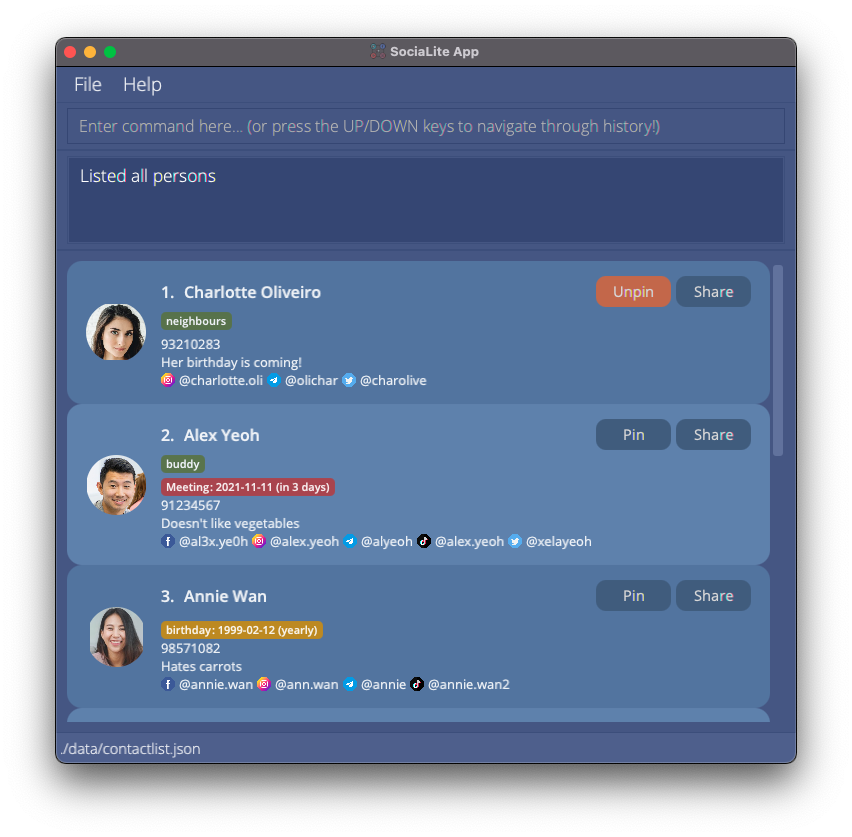

# SociaLite

**SociaLite** is a project developed for the CS2103T Software Engineering module by [our team](docs/AboutUs.md), based off [AddressBook Level 3](https://github.com/se-edu/addressbook-level3). It is a desktop app for **connecting you with your contacts’ social media pages**, optimized for use via a command line interface (CLI) while still having the benefits of a graphical user interface (GUI). If you can type fast, SociaLite can get you to your contacts’ social media pages faster than traditional GUI apps!

### Getting Started

* If you are interested in using SociaLite, check out the [**User Guide**](https://github.com/AY2122S1-CS2103T-F11-4/tp/blob/master/docs/UserGuide.md).
* If you are interested about developing SociaLite, check out the [**Developer Guide**](https://github.com/AY2122S1-CS2103T-F11-4/tp/blob/master/docs/DeveloperGuide.md).

